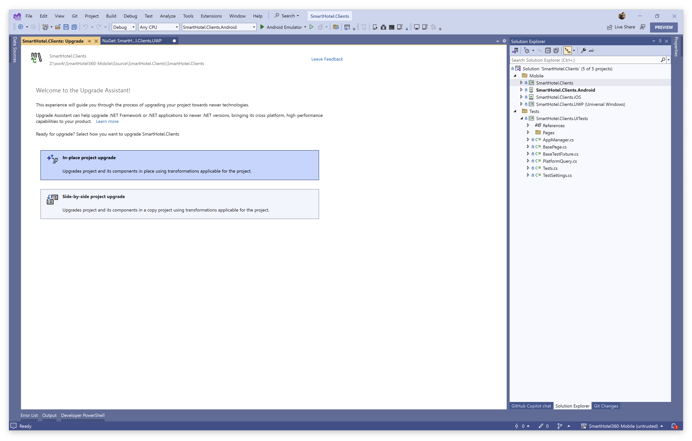
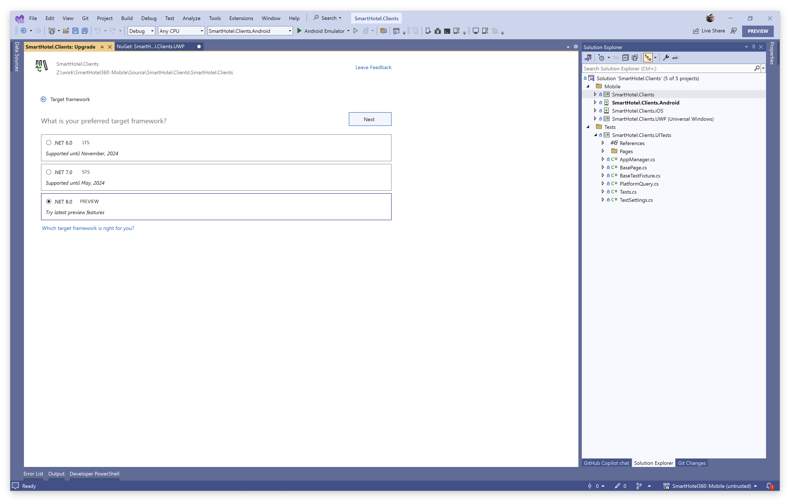
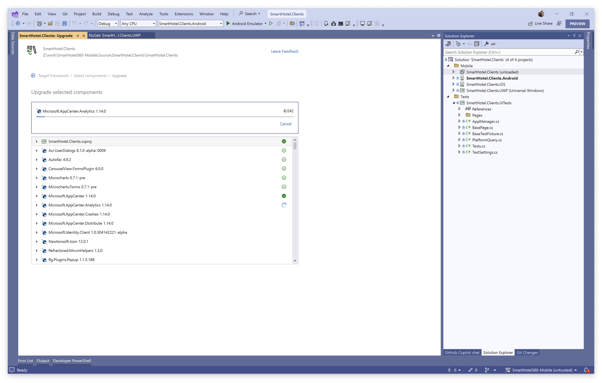
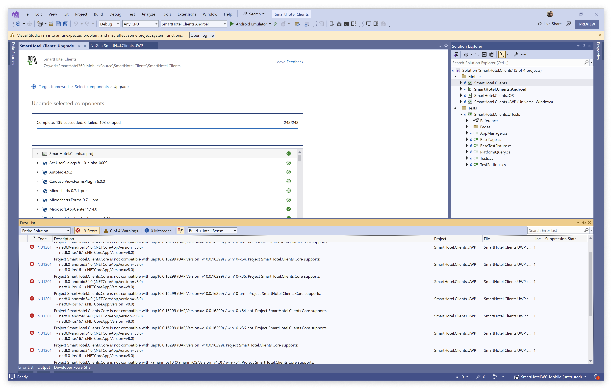
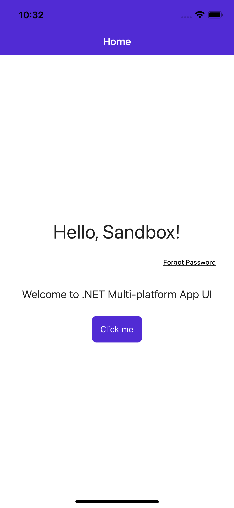
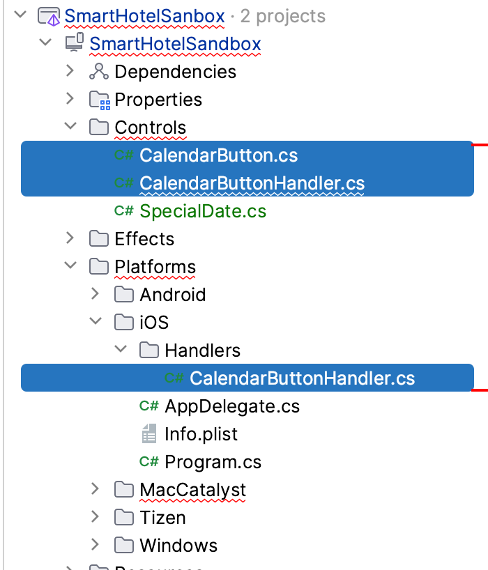
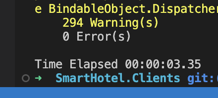

# Upgrading SmartHotel360

SmartHotel360 is a sample application built in 2020 for the Microsoft Connect event in NYC. In this article I'll focus on upgrading the mobile application from Xamarin.Forms 3.6 (aghhh) to .NET MAUI. This is not going to be a step-by-step tutorial, rather I'll document the key decision points, mistakes made, and solutions I chose to cross the finish line. 

If you want to see this app before we get rolling, here's a demo:

YOUTUBE

Let's go!

## Preparation and Planning

Before I DO anything, I'll assess the state of things to identify risk and plan out the work. Here's what stands out to me as I review the solution.

1. Minimum versions - Xamarin.Forms 3.6 is ancient, so to minimize the API differences between Xamarin and .NET I'll upgrade to Xamarin.Forms 5.0
2. NuGets - I see a fair amount of NuGets to review and I'll need a compatible solution for them
3. App "head" projects - I have Android, iOS, and UWP projects along with a .NET Standard 2.0 class library
4. UI Tests - I have a very small set of UI tests that use Xamarin.UITest
5. Native code - I see platform effects, custom renderers, and some services. 

At first glance, I don't see any blockers here so far. I do see work though. 

Here's how I plan to approach it.

1. Upgrade to Xamarin.Forms 5.0
2. Upgrade dependencies to latest versions
3. Make sure the app still works :) `git commit`
4. Review NuGet compat (see below)
5. Run .NET Upgrade Assistant (keeps multiple projects)
6. Perform manual upgrade steps
7. Make a new plan

It's generally pointless to evaluate and assess everything in advance, especially on larger projects. I advise doing little more prep work than this, and being okay with revising your plan as you discover new information.

> **David's Confession:** I've skipped something that some developers, or at least their stakeholders, also assess during this phase which is: "Is .NET MAUI *production ready*?" What it takes to bring a quality app successfully to production differs for each app and owner. I have talked to some companies who are very comfortable with the current state of .NET MAUI, happy to see improvements release over release, and very tolerant of owning solutions (i.e. implementing workarounds) as the product matures. I've also talked to others who treat any product defect as a blocker to shipping their application. What I will confidently say is that the product is improving release over release, and you will need to answer this question for yourself. I do caution against drawing your conclusions exclusively from reddit threads and social media posts.

### NuGet Compatibility

Looking at the NuGets in the project, I can look them up them on NuGet.org and verify they support `net6.0-*` or newer for the platforms I need which are `android`, `ios`, and `windows`. For example, here is Acr.UserDialogs.


From this I can see it has `net6.0-android31.0` and `net6.0-ios15.4`, but nothing for `*-windows`. In this case, I could:

a. fork the repository and attempt to add support for net6.0-windows
b. pay Allan $$$ to add Windows support
c. replace it with something else for Windows or all platforms

In my case, I'll probably end up replacing it since it's not an actively maintained library, and the .NET MAUI Community Toolkit has options now.

| NuGet  | IsCompatible  | Alternative  |
|---|---|---|
| Acr.UserDialogs  | Partially  | Android and iOS should work. I worry about UWP. If not used extensively, I may replace it with CommunityToolkit popups  |
| Autofac  | Yes  |   |
| CarouselView.FormsPlugin  | No  | Replace it with CarouselView  |
| Microcharts | Yes |   |
| Microsoft.AppCenter | Yes |   |
| Microsoft.AppCenter.Analytics | Yes |   |
| Microsoft.AppCenter.Crashes | Yes |   |
| Microsoft.AppCenter.Distribute | Yes |   |
| Microsoft.Identity.Client | Yes |   |
| Newtonsoft.Json | Yes |   |
| Refreactored.MvvmHelpers | Yes |   |
| Rg.Plugins.Popup | No | Mopups may be a replacement, or may port to CommunityToolkit  |
| SkiaSharp | Yes |   |
| SkiaSharp.Views | Yes |   |
| SkiaSharp.Views.Forms | No | Swap with MAUI version  |
| Xamanimation | No | Swap with AlohaKit  |
| Xamarin.Essentials | No | Remove it, all included in .NET MAUI |
| Xamarin.FFImageLoading | No | Swap with MAUI compat version from Redth |
| Xamarin.FFImageLoading.Forms | No | Swap with MAUI compat version from Redth |
| Xamarin.Forms | No | hahahaha  |
| Xamarin.Forms.Maps | No | included in MAUI |
| Xamarin.GooglePlayServices.* | Yes |   |

### Platform Code

For the effects and renderers and services, what should I anticipate?

| Platform code  | Type  | Alternative  |
|---|---|---|
| UnderlineTextEffect  | Effect  | Register it in `MauiProgram` |
| CalendarButtonRenderer | Renderer | |
| CustomMapRenderer | Renderer | |
| CustomNativationPageRenderer | Renderer | |
| CustomSliderRenderer | Renderer | |
| ExtendedEntryRenderer | Renderer | |
| BrowserCookiesService | Service | |
| CardService | Service | |
| DismissKeyboardService | Service | |
| NfcService | Service | |

Alright, I've look at this enough, and I've confirmed the app runs as-is. There are still some unknowns around NuGets and platform-code, but I know what my options are and I'll make those decisions when I get to them. 

## Upgrading

That's enough planning, so now it's time to start doing the work. 

### 1. Upgrade to Xamarin.Forms 5.0

All projects in a solution must use the same versions of NuGets. This is one of the rather annoying parts of having multiple projects - managing the same dependency in many places. .NET MAUI single project makes this much easier, while still having the flexibility to include platform-specific dependencies.

I use the NuGet package manager in Visual Studio to upgrade Xamarin.Forms to the latest release of 5.0.

On my first pass, the NuGet upgrade succeeded for the class library and iOS, but failed on Android. This is because of all the Google dependencies that are referenced explicitly, and they aren't the AndroidX versions. Xamarin.Forms 5.0 references them implicitly, so it's safe to remove the explicit package references and only add back what is needed for the app, which is probably nothing. I like to do this by directly editing the csproj. 

> Version conflict detected for Xamarin.Android.Support.Compat. Install/reference Xamarin.Android.Support.Compat 28.0.0.1 directly to project SmartHotel.Clients.Android to resolve this issue. 
> SmartHotel.Clients.Android -> Acr.UserDialogs 7.0.4 -> Xamarin.Android.Support.Design 28.0.0.1 -> Xamarin.Android.Support.Compat (= 28.0.0.1) 
> SmartHotel.Clients.Android -> CarouselView.FormsPlugin 5.2.0 -> Xamarin.Android.Support.v4 25.4.0.2 -> Xamarin.Android.Support.Compat (= 25.4.0.2).
> Restore failed.

Before I do that, I know I'll be updating those other dependencies also so I might as well start there. And...that took care of it. 

Will it build? Firstly, anytime NuGets are changed like this it's advisable to delete the bin/obj folders, and reload the solution in Visual Studio. From CLI in the parent folder I run:

```console
find . -iname "bin" -o -iname "obj" | xargs rm -rf
```

Upon reloading the solution, the NuGet restore succeeds (with warnings), and I cannot build. 

```
/Users/dmo/work/SmartHotel360-Mobile/Source/SmartHotel.Clients/SmartHotel.Clients/Views/LoginView.xaml: Error XFC0009: No property, BindableProperty, or event found for "OS", or mismatching type between value and property. (XFC0009) (SmartHotel.Clients) XamlC
```

Time to resolve changes between 3.6 and 5.0! 

In my case I only needed to fix some syntax changes to `OnPlatform` and `OnIdiom` XAML markup extensions. At some point XAMLC started enforcing comma separation. /shrug

The app runs, and I see some minor UI issues, but nothing worth addressing at this phase since this is just a waypoint and not the destination.

> My original plan was to update ALL the NuGet dependencies to the latest version, but now I'm wondering how efficient that is. Some of them I won't even keep in .NET MAUI. Bail. I'm going to the next step.

### 2. Run .NET Upgrade Assistant

I've been working all from my Mac so far, but now I'll spin up Parallels so I can run the .NET Upgrade Assistant from the Visual Studio extension. It has the most up-to-date features right now, though the CLI version for macOS is being updated and will ship soon.

> Fair warning - the assistant does a lot of work for the upgrade, but you will be almost certainly not be in a running state when it completes without doing some manual work. Set your expectations now.

Starting with the class library, I right-click and choose "Upgrade". Since I'm using git, I did an in place upgrade and those tend to work more consistently anyway.



I chose to upgrade to .NET 8 even though it's a preview, because it has way more quality improvements compared to 7.0 and will be RC in just a few weeks. I don't have any desired to work around issues in 7.0 that are already fixed in 8.0. :)



Once running, I can see the progress including what has completed, and what was skipped. While the assistant knows what to do about a few NuGets, it won't about most and that'll be for us to address later.

> Ignore pretty much all Visual Studio warnings or even errors during the upgrade process. We will be in a broken state for a while.





Once finished, I move on to the "head" projects one by one and do the same thing. Oh, and the test project.

### 3. Perform manual upgrade steps

I'm going back to my Mac, and from here on out I'll be using VS Code. The official documentation covers most of the changes I'll need to address manually.

https://learn.microsoft.com/dotnet/maui/migration/forms-projects

#### iOS

I need to verify and fix up the `AppDelegate` since .NET MAUI and Xamarin.Forms doing this quite differently there.

```
public partial class AppDelegate : global::Xamarin.Forms.Platform.iOS.FormsApplicationDelegate
```

Well, that's wrong. Really the UA should've changed that, so I'll file a report on it. It needs to change to `MauiUIApplicationDelegate`.

Also I need to add just this inside the class:

```csharp
protected override MauiApp CreateMauiApp() => MauiProgram.CreateMauiApp();
```

Ah, and there's a bunch of UITest and App Center configuration happening here. I'm going to take care of all the easy stuff first, and just comment out things that aren't critical to getting a successful build. App Center and Azure AD do have upgrades available, but I'm not going to cover those here. The same upgrade concepts I'll apply to other dependencies will work for those.

Most all of this can be eliminated or moved to `MauiProgram`:

```csharp
Forms.Init();
FFImageLoading.Forms.Platform.CachedImageRenderer.Init();
CarouselViewRenderer.Init();
Renderers.Calendar.Init();
Xamarin.FormsMaps.Init();
InitChartView();
InitXamanimation();
Rg.Plugins.Popup.Popup.Init();

RegisterPlatformDependencies();
LoadApplication(new App());
```

I'm going to remove the minimum iOS version b/c .NET MAUI will set it for my automatically, and I already know this is going to be too low. 

```xml
<key>MinimumOSVersion</key>
<string>8.0</string>	
```

Looks like some more references weren't upgraded in the effects. Good news, the docs show me what to do. https://learn.microsoft.com/en-us/dotnet/maui/migration/effects

```csharp
using Foundation;
using SmartHotel.Clients.iOS.Effects;
using UIKit;
using Xamarin.Forms.Platform.iOS;
using Microsoft.Maui.Controls;
using Microsoft.Maui;

[assembly: ExportEffect(typeof(UnderlineTextEffect), "UnderlineTextEffect")]
namespace SmartHotel.Clients.iOS.Effects
{
    public class UnderlineTextEffect : PlatformEffect
    {
        protected override void OnAttached()
        {
            var element = Element as Label;

            if (Control is UILabel label && element != null)
            {
                var attributes = new UIStringAttributes { UnderlineStyle = NSUnderlineStyle.Single };
                var attrString = new NSAttributedString(element.Text, attributes);
                label.AttributedText = attrString;
            }
        }

        protected override void OnDetached()
        {
        }
    }
}
```

https://github.com/Sweekriti91/mapbox-xamarin-forms/blob/maui_migrate/demo/

> Suggestion: Add `AppDelegate_Template.cs` to the project with stubs for the places where the dev should relocate code. Same for other template files. Add a `MauiProgram.cs` to head projects also, and wire up with the shared file.

> Understanding `<SingleProject>true</SingleProject>` - this will enable the multi-targeting rules for the Platforms folders in the project. I can be used in combination with multiple projects like this.

I'm going to follow a pattern I got from Sweeky where each app project gets a `MauiProgram` where it can perform platform specific configuration. This will retain some duplication that single project removes, but it keeps the code similar to what it was in Xamarin.Forms.

For an example of what this look like, check out https://github.com/Sweekriti91/mapbox-xamarin-forms/blob/maui_migrate/demo/

I need to register some dependencies as I upgrade NuGet packages and replace others.

## Creating an Upgrade Sandbox

It can be frustrating upgrading a large solution, moving lots of code around, and going for long periods of time without any confirmation that the work you are doing compiles and succeeds. In order to provide that confidence, I created a blank sandbox solution where I can implement changes (effects, renderers to handlers, etc.) in isolation to confirm success before bring those changes back into the app solution.

> **Update** After I did this myself, I discussed this need with Matthew Leibowitz from our SDK team, and he created a [blank multi-project solution](https://github.com/mattleibow/MauiMultiHeadProject) to use as a .NET MAUI template that mirrors Xamarin.Forms. To install it, clone the repository and run: `dotnet new install src\Microsoft.Maui.Templates.MauiMultiHeadApp\content --force`. Then you can create a new solution with `dotnet new maui-multihead -n MySandbox`.



I've detailed a few things below for the curious, but if you (like me) really just want to skip ahead then use Matthew's template.

## Creating from Scratch

To mimic the Xamarin.Forms solution, I created a blank solution and added the following projects:

* SmartHotelSandbox - a new .NET MAUI project that I changed to a class library ()
* SmartHotelSandbox.iOS - a .NET for iOS project
* SmartHotelSandbox.Android - a .NET for Android project
* SmartHotelSandbox.Windows - a WinUI project



> **David's Confession:** as of this writing I've only done the class library and iOS project. I'll do Android and Windows later.

### New Project: SmartHotelSandbox

Here's the bare `csproj` file. See that it outputs a `library` rather than an `exe`. I kept the platforms I care about right now (mobile...I'll need desktop later, but I'm working from a Mac). I also kept the `SingleProject` and related settings for fonts, images, and assets. Even though I'm using multiple projects, I can still benefit from these advancements, and multi-targeting from the `Platforms` folder.

As I work through implementing things in this sandbox, I will incrementally add NuGets and resources as needed.

```xml
<Project Sdk="Microsoft.NET.Sdk">
  <PropertyGroup>
    <TargetFrameworks>net8.0-android;net8.0-ios</TargetFrameworks>
    <UseMaui>True</UseMaui>
    <OutputType>Library</OutputType>
    <ImplicitUsings>enable</ImplicitUsings>
    <SingleProject>true</SingleProject>

    <SupportedOSPlatformVersion Condition="$([MSBuild]::GetTargetPlatformIdentifier('$(TargetFramework)')) == 'ios'">11.0</SupportedOSPlatformVersion>
    <SupportedOSPlatformVersion Condition="$([MSBuild]::GetTargetPlatformIdentifier('$(TargetFramework)')) == 'android'">21.0</SupportedOSPlatformVersion>
  </PropertyGroup>

  <ItemGroup>
		<!-- Images -->
		<MauiImage Include="Resources\Images\*" />
		
		<!-- Custom Fonts -->
		<MauiFont Include="Resources\Fonts\*" />

		<!-- Raw Assets (also remove the "Resources\Raw" prefix) -->
		<MauiAsset Include="Resources\Raw\**" LogicalName="%(RecursiveDir)%(Filename)%(Extension)" />
	</ItemGroup>
  
  <ItemGroup>
    <PackageReference Include="Microsoft.Maui.Controls" Version="$(MauiVersion)" />
    <PackageReference Include="Microsoft.Maui.Controls.Compatibility" Version="$(MauiVersion)" />
    <PackageReference Include="Microsoft.Extensions.Logging.Debug" Version="8.0.0-preview.6.23329.7" />
  </ItemGroup>
  
</Project>
```

Since the app project will do the final `MauiProgram` initialization, I just need a host builder extension method where I can do some xplat things in the library. I originally went an [implementation](https://github.com/Sweekriti91/mapbox-xamarin-forms/blob/maui_migrate/demo/MapBoxQs/MauiProgram.cs) Sweeky shared with me, but have since adopted the pattern Matthew uses in the templates.

In the library, I have `MauiProgramExtensions.cs`:

```csharp
using CommunityToolkit.Maui;
using CommunityToolkit.Maui.Core;
using CommunityToolkit.Maui.Core.Platform;
using FFImageLoading.Maui;
using Microcharts.Maui;
using Microsoft.Maui.Controls.Compatibility.Hosting;
using SmartHotel.Clients;
using SmartHotel.Clients.Core.Helpers;

namespace SmartHotelSandbox;

public static class MauiProgramExtensions
{
	public static MauiAppBuilder UseSharedMauiApp(this MauiAppBuilder builder)
	{
		builder
            .UseMauiApp<App>()
            .ConfigureFonts(fonts =>
            {
                
            });

		return builder;
	}
}
```

Because I retained the single project stuff, I can copy the fonts into the Resources/Fonts folder and configure them in this location. 

### New Project: SmartHotelSandbox.iOS

First I add a `MauiProgram.cs` which calls `UseSharedMauiApp` which we just created:

```csharp
namespace SmartHotelSandbox.iOS;

public static class MauiProgram
{
    public static MauiApp CreateMauiApp()
    {
        var build = MauiApp.CreateBuilder();

        build.UseSharedMauiApp<App>()
            .UseMauiCompatibility()
            .ConfigureEffects(effects =>
            {
                
            })
            .ConfigureMauiHandlers(handlers =>
            {
                
            });

        return builder.Build();
    }
}
```

The rest of the iOS files are like the standard iOS folder in a new project, so I won't go into detail there. 

This is the solution where I'll port code piece by piece to confirm as I go that effects, renderers, and whatever else works before I bring those changes back into the upgraded solution for "final assembly" (of course there will be more work, so it's more like final v1).


### Reusing Effects

Firstly, look at what your effect does and consider if it's even needed anymore. I'm going to get this `UnderlineTextEffect` working, but I should also just omit it since `Label` now supports underline.

```xml
<Label
    TextDecorations="Underline"/>
```

The original RoutingEffect specified an `effectId` of `SmartHotel.UnderlineTextEffect`. For reasons I cannot yet explain, this doesn't work. If you find that's the case for you, remove it.

I moved the `RoutingEffect` into my sandbox class library.

```csharp
namespace SmartHotel.Clients.Core.Effects
{
    public class UnderlineTextEffect : RoutingEffect
    {
        public UnderlineTextEffect() : base()
        {
        }
    }
}
```

And the `PlatformEffect` into the iOS project.

```csharp
using Foundation;
using UIKit;
using Microsoft.Maui.Controls.Platform;

namespace SmartHotel.Clients.iOS.Effects
{
    public class UnderlineTextEffect : PlatformEffect
    {
        protected override void OnAttached()
        {
            var element = Element as Label;

            if (Control is UILabel label && element != null)
            {
                var attributes = new UIStringAttributes { UnderlineStyle = NSUnderlineStyle.Single };
                var attrString = new NSAttributedString(element.Text, attributes);
                label.AttributedText = attrString;
            }
        }

        protected override void OnDetached()
        {
        }
    }
}
```

In order to use the effect I need to register it in the platform's `MauiProgram.cs`.

```csharp
var build = Builder;
build.UseMauiApp<App>()
    .UseMauiCompatibility()
    .UseMauiCommunityToolkit()
    .UseFFImageLoading()
    .ConfigureEffects(effects =>
    {
        effects.Add<UnderlineTextEffect, SmartHotel.Clients.iOS.Effects.UnderlineTextEffect>();
    });
```

I can then use the effect in XAML and confirm it works. I found an example of it used in the app project and copied over the basic elements to confirm it works.

```xml
<Label 
    HeightRequest="24"
    HorizontalTextAlignment="End"
    TextColor="Black"
    Text="Forgot Password">
    <Label.Effects>
        <effects:UnderlineTextEffect />
    </Label.Effects>
</Label>
```



> **Alternative Solution** I could instead move the platform code into the class library and use multi-targeting. This is what the [official documentation](https://learn.microsoft.com/dotnet/maui/migration/effects) demonstrates.

### Custom Renderers

When it comes to custom renderers there isn't a "one size fits all" solution. How you upgrade renderers will depend mostly on what class it extends.

| Usage | Recommendation |
|:----|:----|
| Extends `FrameRenderer`, `ListViewRenderer`, `ShellRenderer`, `TableViewRenderer`, or `VisualElementRenderer` | [Reuse with renderer shims](https://learn.microsoft.com/en-us/dotnet/maui/migration/custom-renderers) |
| Anything else | [Migrate to a handler](https://learn.microsoft.com/dotnet/maui/migration/renderer-to-handler) |

The links above cover many details and steps. I'll just relate a few examples here and you can reference the code for the rest. 

Going back to the list of renderers, here is my plan (updated with what I ended up actually doing): 

| Renderer  | Extends  | Plan  | Actual |
|---|---|---|---|
| CalendarButtonRenderer | ButtonRenderer > ViewRenderer > VisualElementRenderer | Shim | Handler |
| CustomMapRenderer | MapRenderer > ViewRenderer > VisualElementRenderer | Shim | Handler |
| CustomNativationPageRenderer | NavigationRenderer > UINavigationController | Handler | Removed |
| CustomPageRenderer | PageRenderer > UIViewController | Handler | Removed |
| CustomSliderRenderer | SliderRenderer > ViewRenderer > VisualElementRenderer | Shim | AppendToMapping |
| ExtendedEntryRenderer | EntryRenderer > EntryRendererBase > ViewRenderer > VisualElementRenderer | Shim | Handler |
| TransparentViewCell | [ViewCellRenderer ... ElementHandler](https://github.com/dotnet/maui/blob/main/src/Controls/src/Core/Compatibility/Handlers/ListView/iOS/CellRenderer.cs) | Shim | Shim |

> **David's Confession:** as with most plans, they often go awry. Sometimes we call those lessons, or in today's business-speak "learnings". The "shim" approach only works reliably for a small category of views, and for those that it kinda works for I found my effort is better spent porting the code to a handler instead. I learned this (and more) on the `CalendarButtonRenderer`.

#### CalendarButtonRenderer

Following the documentation for creating a handler, I copied over the xplat `CalendarButton` class which stays the same, and created a new xplat partial class `CalendarButtonHandler` and platform specific partial class `CalendarButtonhandler` located in the Platforms/iOS folder so it's multi-targeted.



The xplat `CalendarButtonHandler` creates the mapper, and the platform specific version implements. That's probably an oversimplification, but it's how I'm thinking about it simply. I was previously extending `ButtonRenderer`, so now I can extend `ButtonHandler`.

Creating the mapper, I look at the properties being set in the `OnElementPropertyChanged` in the custom renderer, and I change those to mapped methods.

Renderer code:

```csharp
protected override void OnElementPropertyChanged(object sender, System.ComponentModel.PropertyChangedEventArgs e)
{
    base.OnElementPropertyChanged(sender, e);
    var element = Element as CalendarButton;
    if (e.PropertyName == nameof(element.TextWithoutMeasure) || e.PropertyName == "Renderer")
    {
        Control.SetTitle(element.TextWithoutMeasure, UIControlState.Normal);
        Control.SetTitle(element.TextWithoutMeasure, UIControlState.Disabled);
    }
    if (e.PropertyName == nameof(element.TextColor) || e.PropertyName == "Renderer")
    {
        Control.SetTitleColor(element.TextColor.ToUIColor(), UIControlState.Disabled);
        Control.SetTitleColor(element.TextColor.ToUIColor(), UIControlState.Normal);
    }
    if (e.PropertyName == nameof(element.BackgroundPattern))
    {
        DrawBackgroundPattern();
    }
    if (e.PropertyName == nameof(element.BackgroundImage))
    {
        DrawBackgroundImage();
    }
}
```

The xplat handler declares the platform view type using conditional compilation directives, and then stubs out the map.

```csharp
using Microsoft.Maui.Handlers;
#if IOS || MACCATALYST
using PlatformView = UIKit.UIButton;
#elif (NETSTANDARD || !PLATFORM) || (NET6_0_OR_GREATER && !IOS && !ANDROID)
using PlatformView = System.Object;
#endif

namespace SmartHotel.Clients.Core.Controls;

public partial class CalendarButtonHandler : ButtonHandler
{
    public static PropertyMapper<CalendarButton, CalendarButtonHandler> PropertyMapper = new PropertyMapper<CalendarButton, CalendarButtonHandler>(Mapper)
    {
        [nameof(CalendarButton.TextWithoutMeasure)] = MapTextWithoutMeasure,
        [nameof(CalendarButton.BackgroundPattern)] = MapBackgroundPattern,
        [nameof(CalendarButton.BackgroundImage)] = MapBackgroundImage,
    };


    public CalendarButtonHandler() : base(PropertyMapper)
    {
    }
}
```

All that remains is to implement the iOS (and other platform) code for these methods.

```csharp
using CoreGraphics;
using Microsoft.Maui.Controls.Compatibility.Platform.iOS;
using Microsoft.Maui.Handlers;
using Microsoft.Maui.Platform;
using SmartHotel.Clients.Core.Controls;
using UIKit;

namespace SmartHotel.Clients.Core.Controls;

public partial class CalendarButtonHandler : ButtonHandler
{
    protected override UIButton CreatePlatformView() => new UIButton();

    protected override void ConnectHandler(UIButton platformView)
    {
        base.ConnectHandler(platformView);

        // Perform any control setup here
    }

    protected override void DisconnectHandler(UIButton platformView)
    {
        // Perform any native view cleanup here
        platformView.Dispose();
        base.DisconnectHandler(platformView);
    }
    
    private static async void MapBackgroundImage(CalendarButtonHandler handler, CalendarButton view)
    {
        var element = view as CalendarButton;
        if (element == null) return;
        if (element.BackgroundImage != null)
        {
            var image = await GetImage(element.BackgroundImage);
            handler.PlatformView.SetBackgroundImage(image, UIControlState.Normal);
            handler.PlatformView.SetBackgroundImage(image, UIControlState.Disabled);
        }
        else
        {
            handler.PlatformView.SetBackgroundImage(null, UIControlState.Normal);
            handler.PlatformView.SetBackgroundImage(null, UIControlState.Disabled);
        }
    }
    
    private static Task<UIImage> GetImage(FileImageSource image)
    {
        var handler = new FileImageSourceHandler();
        return handler.LoadImageAsync(image);
    }

    private static void MapBackgroundPattern(CalendarButtonHandler handler, CalendarButton view)
    {
        if (!(view is CalendarButton element) || view.BackgroundPattern == null || handler.PlatformView.Frame.Width == 0) return;

        UIImage image;
        UIGraphics.BeginImageContext(handler.PlatformView.Frame.Size);
        using (var g = UIGraphics.GetCurrentContext())
        {
            for (var i = 0; i < view.BackgroundPattern.Pattern.Count; i++)
            {
                var p = view.BackgroundPattern.Pattern[i];
                g.SetFillColor(p.Color.ToCGColor());
                var l = (int)Math.Ceiling(handler.PlatformView.Frame.Width * view.BackgroundPattern.GetLeft(i));
                var t = (int)Math.Ceiling(handler.PlatformView.Frame.Height * view.BackgroundPattern.GetTop(i));
                var w = (int)Math.Ceiling(handler.PlatformView.Frame.Width * view.BackgroundPattern.Pattern[i].WidthPercent);
                var h = (int)Math.Ceiling(handler.PlatformView.Frame.Height * view.BackgroundPattern.Pattern[i].HightPercent);
                g.FillRect(new CGRect { X = l, Y = t, Width = w, Height = h });
            }

            image = UIGraphics.GetImageFromCurrentImageContext();
        }
        UIGraphics.EndImageContext();
        handler.PlatformView.SetBackgroundImage(image, UIControlState.Normal);
        handler.PlatformView.SetBackgroundImage(image, UIControlState.Disabled);
    }

    private static void MapTextWithoutMeasure(CalendarButtonHandler handler, CalendarButton view)
    {
        handler.PlatformView.SetTitle(view.TextWithoutMeasure, UIControlState.Normal);
        handler.PlatformView.SetTitle(view.TextWithoutMeasure, UIControlState.Disabled);
    }
}
```

I chose NOT to bring over the `TextColor` code. Why? At first glance it looked unnecessary since the `Button` already supports that by default. Just to confirm it sets both normal and disabled states, I checked the [source code](https://github.com/dotnet/maui/blob/main/src/Core/src/Platform/iOS/ButtonExtensions.cs#L31-L43) for `ButtonExtensions`. Yup, it's covered.

> **David's Confession:** On my first pass I made a mistake implementing the xplat handler code. I couldn't figure out why the text color wasn't being applied despite confirming that `ButtonHandler` definitely supported that property. It turns out I created a blank `PropertyMapper` instead of passing in the existing mapper already full of mappings. So I needed `new PropertyMapper<CalendarButton, CalendarButtonHandler>(Mapper)` instead of `new PropertyMapper<CalendarButton, CalendarButtonHandler>()`.

#### ViewCellRenderer

The `TransparentViewCell` renderer on iOS removes the default selection style so that the `ListView` can set it by reference. In order to migrate this type of renderer to .NET MAUI I made sure it extended the right compatibility type, in this case a `ViewCellRenderer` from that namespace. I then remove the `[Export]` attribute and register the renderer as a handler directly. 

```csharp
using UIKit;
using ViewCellRenderer = Microsoft.Maui.Controls.Handlers.Compatibility.ViewCellRenderer;

namespace SmartHotel.Clients.iOS.Renderers;

public class TransparentViewCell : ViewCellRenderer
{
    public override UITableViewCell GetCell(Cell item, UITableViewCell reusableCell, UITableView tv)
    {
        var cell = base.GetCell(item, reusableCell, tv);

        if (cell != null)
        {
            cell.SelectionStyle = UITableViewCellSelectionStyle.None;
        }

        return cell;
    }
}
```

In the iOS project's `MauiProgram.cs` I add to the existing handler registrations:

```csharp
.ConfigureMauiHandlers(handlers =>
            {
                handlers.AddHandler(typeof(CalendarButton), typeof(CalendarButtonHandler));
                handlers.AddHandler(typeof(ViewCell), typeof(TransparentViewCell));
            })
```

`AddHandler` is always the method to use for registration, even when a view like this extends a renderer class. Ignore the leftover `AddCompatibilityRenderer` as this doesn't do what you need and should be removed in the future.

#### CustomSliderRenderer

When I looked at this, it is only for Android and it only touches a single platform property `IsThumbTooltipEnabled`. This is where I can use the easiest of all handler options, `AppendToMapping`.

```csharp
private static void OverrideHandlers()
{
#if ANDROID
    Microsoft.Maui.Handlers.SliderHandler.Mapper.AppendToMapping("NoThumbs", (handler, slider) =>
    {
        handler.PlatformView.IsThumbToolTipEnabled = false;  
    });
#endif
}
```

This will affect all sliders in the app, which is fine and is actually what the renderer was doing also:

```csharp
[assembly: ExportRenderer(typeof(Xamarin.Forms.Slider), typeof(CustomSliderRenderer))]
```

From the `Mapper` of any handler I can modify, replace, append to, or prepend to any mapping. The append option will run after the existing mappings which is good for most cases including this. 

My `OverrideHandlers` method is called from within `MauiProgram.cs`, though you can put it anywhere that runs before the controls are used. 

#### Other renderers

The remaining renderers can follow the patterns above, so I've implemented them as handlers. This applies to `ExtendedEntryRenderer` and `CustomMapRenderer`.

What about `CustomNavigationRenderer` and `CustomPageRenderer`? Looking at what these do, I'm going to ignore them for now. I think I might be able to do the same thing without them. I'll find out!

**CustomNavigationRenderer**
- iOS sets status bar style
- Android sets different toolbar layout size

**CustomPageRenderer**
- iOS sets nav bar text color
- Android does nothing

> **Resource:** A page renderer to handler sample: https://github.com/TomSoderling/MigratedPageRendererExample/

## Bringing everything together

Now I'll take the sandbox work and bring it back into the main solution, compile, and then follow the error rainbow to my promised treasure.

Building gives me the error:

```
/Users/dmo/.nuget/packages/xamarin.forms/2.5.0.121934/build/netstandard1.0/Xamarin.Forms.targets(55,3): error MSB4062: The "Xamarin.Forms.Build.Tasks.GetTasksAbi" task could not be loaded from the assembly /Users/dmo/.nuget/packages/xamarin.forms/2.5.0.121934/build/netstandard1.0/Xamarin.Forms.Build.Tasks.dll. Could not load file or assembly 'Microsoft.Build.Utilities.v4.0, Version=4.0.0.0, Culture=neutral, PublicKeyToken=b03f5f7f11d50a3a'. The system cannot find the file specified. [/Users/dmo/work/SmartHotel360-Mobile/Source/SmartHotel.Clients/SmartHotel.Clients/SmartHotel.Clients.csproj::TargetFramework=net8.0-ios]
/Users/dmo/.nuget/packages/xamarin.forms/2.5.0.121934/build/netstandard1.0/Xamarin.Forms.targets(55,3): error MSB4062:  Confirm that the <UsingTask> declaration is correct, that the assembly and all its dependencies are available, and that the task contains a public class that implements Microsoft.Build.Framework.ITask. [/Users/dmo/work/SmartHotel360-Mobile/Source/SmartHotel.Clients/SmartHotel.Clients/SmartHotel.Clients.csproj::TargetFramework=net8.0-ios]
```

I need to hunt down where there's coming from. Looking at the NuGets, I have some leftover XF packages that might be the cause.

```xml
<PackageReference Include="Rg.Plugins.Popup" Version="1.1.5.188" />
<PackageReference Include="CarouselView.FormsPlugin" Version="6.0.0" />
```

Now I can compile and get some errors I know how to resolve. I see Microcharts namespace issues, and I resolve them.

Rg to mopups
<PackageReference Include="Mopups" Version="1.1.1" />

```
/Users/dmo/work/SmartHotel360-Mobile/Source/SmartHotel.Clients/SmartHotel.Clients/ViewModels/MyRoomViewModel.cs(39,12): error CS0104: 'Timer' is an ambiguous reference between 'SmartHotel.Clients.Core.Helpers.Timer' and 'System.Threading.Timer' [/Users/dmo/work/SmartHotel360-Mobile/Source/SmartHotel.Clients/SmartHotel.Clients/SmartHotel.Clients.csproj::TargetFramework=net8.0-ios]
```

```
/Users/dmo/work/SmartHotel360-Mobile/Source/SmartHotel.Clients/SmartHotel.Clients/ViewModels/HomeViewModel.cs(18,27): error CS0234: The type or namespace name 'Entry' does not exist in the namespace 'Microcharts' (are you missing an assembly reference?) [/Users/dmo/work/SmartHotel360-Mobile/Source/SmartHotel.Clients/SmartHotel.Clients/SmartHotel.Clients.csproj::TargetFramework=net8.0-ios]
/Users/dmo/work/SmartHotel360-Mobile/Source/SmartHotel.Clients/SmartHotel.Clients/ViewModels/OpenDoorViewModel.cs(10,18): error CS0234: The type or namespace name 'Maui' does not exist in the namespace 'SmartHotel' (are you missing an assembly reference?) [/Users/dmo/work/SmartHotel360-Mobile/Source/SmartHotel.Clients/SmartHotel.Clients/SmartHotel.Clients.csproj::TargetFramework=net8.0-ios]
/Users/dmo/work/SmartHotel360-Mobile/Source/SmartHotel.Clients/SmartHotel.Clients/Helpers/MapHelper.cs(31,57): error CS0104: 'Map' is an ambiguous reference between 'Microsoft.Maui.ApplicationModel.Map' and 'Microsoft.Maui.Controls.Maps.Map' [/Users/dmo/work/SmartHotel360-Mobile/Source/SmartHotel.Clients/SmartHotel.Clients/SmartHotel.Clients.csproj::TargetFramework=net8.0-ios]
/Users/dmo/work/SmartHotel360-Mobile/Source/SmartHotel.Clients/SmartHotel.Clients/Controls/Calendar/Calendar.MonthNavigation.cs(157,10): error CS0104: 'Font' is an ambiguous reference between 'Microsoft.Maui.Graphics.Font' and 'Microsoft.Maui.Font' [/Users/dmo/work/SmartHotel360-Mobile/Source/SmartHotel.Clients/SmartHotel.Clients/SmartHotel.Clients.csproj::TargetFramework=net8.0-ios]
/Users/dmo/work/SmartHotel360-Mobile/Source/SmartHotel.Clients/SmartHotel.Clients/Controls/Calendar/Calendar.MonthNavigation.cs(283,10): error CS0104: 'Font' is an ambiguous reference between 'Microsoft.Maui.Graphics.Font' and 'Microsoft.Maui.Font' [/Users/dmo/work/SmartHotel360-Mobile/Source/SmartHotel.Clients/SmartHotel.Clients/SmartHotel.Clients.csproj::TargetFramework=net8.0-ios]
/Users/dmo/work/SmartHotel360-Mobile/Source/SmartHotel.Clients/SmartHotel.Clients/ViewModels/Base/Locator.cs(24,9): error CS0104: 'IContainer' is an ambiguous reference between 'Autofac.IContainer' and 'Microsoft.Maui.IContainer' [/Users/dmo/work/SmartHotel360-Mobile/Source/SmartHotel.Clients/SmartHotel.Clients/SmartHotel.Clients.csproj::TargetFramework=net8.0-ios]
``````

After resolving those, I now get

```
/Users/dmo/work/SmartHotel360-Mobile/Source/SmartHotel.Clients/SmartHotel.Clients/App.xaml.cs(29,17): error CS0619: 'PublicClientApplication.PublicClientApplication(string, string)' is obsolete: 'Use PublicClientApplicationBuilder instead. See https://aka.ms/msal-net-3-breaking-changes. ' [/Users/dmo/work/SmartHotel360-Mobile/Source/SmartHotel.Clients/SmartHotel.Clients/SmartHotel.Clients.csproj::TargetFramework=net8.0-ios]
/Users/dmo/work/SmartHotel360-Mobile/Source/SmartHotel.Clients/SmartHotel.Clients/Controls/TemperatureChart.cs(27,38): error CS0103: The name 'Entries' does not exist in the current context [/Users/dmo/work/SmartHotel360-Mobile/Source/SmartHotel.Clients/SmartHotel.Clients/SmartHotel.Clients.csproj::TargetFramework=net8.0-ios]
/Users/dmo/work/SmartHotel360-Mobile/Source/SmartHotel.Clients/SmartHotel.Clients/Controls/TemperatureChart.cs(29,34): error CS0103: The name 'Entries' does not exist in the current context [/Users/dmo/work/SmartHotel360-Mobile/Source/SmartHotel.Clients/SmartHotel.Clients/SmartHotel.Clients.csproj::TargetFramework=net8.0-ios]
/Users/dmo/work/SmartHotel360-Mobile/Source/SmartHotel.Clients/SmartHotel.Clients/Controls/Calendar/Calendar.cs(26,41): error CS0117: 'Color' does not contain a definition for 'Transparent' [/Users/dmo/work/SmartHotel360-Mobile/Source/SmartHotel.Clients/SmartHotel.Clients/SmartHotel.Clients.csproj::TargetFramework=net8.0-ios]
/Users/dmo/work/SmartHotel360-Mobile/Source/SmartHotel.Clients/SmartHotel.Clients/Controls/Calendar/Calendar.cs(52,41): error CS0117: 'Color' does not contain a definition for 'Transparent' [/Users/dmo/work/SmartHotel360-Mobile/Source/SmartHotel.Clients/SmartHotel.Clients/SmartHotel.Clients.csproj::TargetFramework=net8.0-ios]
/Users/dmo/work/SmartHotel360-Mobile/Source/SmartHotel.Clients/SmartHotel.Clients/Controls/TemperatureChart.cs(49,35): error CS0103: The name 'Entries' does not exist in the current context [/Users/dmo/work/SmartHotel360-Mobile/Source/SmartHotel.Clients/SmartHotel.Clients/SmartHotel.Clients.csproj::TargetFramework=net8.0-ios]
/Users/dmo/work/SmartHotel360-Mobile/Source/SmartHotel.Clients/SmartHotel.Clients/Views/SettingsView.xaml.cs(14,13): error CS0122: 'MessagingCenter' is inaccessible due to its protection level [/Users/dmo/work/SmartHotel360-Mobile/Source/SmartHotel.Clients/SmartHotel.Clients/SmartHotel.Clients.csproj::TargetFramework=net8.0-ios]
/Users/dmo/work/SmartHotel360-Mobile/Source/SmartHotel.Clients/SmartHotel.Clients/Controls/TemperatureChart.cs(64,31): error CS1061: 'Entry' does not contain a definition for 'Color' and no accessible extension method 'Color' accepting a first argument of type 'Entry' could be found (are you missing a using directive or an assembly reference?) [/Users/dmo/work/SmartHotel360-Mobile/Source/SmartHotel.Clients/SmartHotel.Clients/SmartHotel.Clients.csproj::TargetFramework=net8.0-ios]
/Users/dmo/work/SmartHotel360-Mobile/Source/SmartHotel.Clients/SmartHotel.Clients/Controls/TemperatureChart.cs(70,60): error CS1061: 'Entry' does not contain a definition for 'Value' and no accessible extension method 'Value' accepting a first argument of type 'Entry' could be found (are you missing a using directive or an assembly reference?) [/Users/dmo/work/SmartHotel360-Mobile/Source/SmartHotel.Clients/SmartHotel.Clients/SmartHotel.Clients.csproj::TargetFramework=net8.0-ios]
/Users/dmo/work/SmartHotel360-Mobile/Source/SmartHotel.Clients/SmartHotel.Clients/Controls/TemperatureChart.cs(83,20): error CS1061: 'SKCanvas' does not contain a definition for 'DrawCaptionLabels' and no accessible extension method 'DrawCaptionLabels' accepting a first argument of type 'SKCanvas' could be found (are you missing a using directive or an assembly reference?) [/Users/dmo/work/SmartHotel360-Mobile/Source/SmartHotel.Clients/SmartHotel.Clients/SmartHotel.Clients.csproj::TargetFramework=net8.0-ios]
/Users/dmo/work/SmartHotel360-Mobile/Source/SmartHotel.Clients/SmartHotel.Clients/Controls/TemperatureChart.cs(84,20): error CS1061: 'SKCanvas' does not contain a definition for 'DrawCaptionLabels' and no accessible extension method 'DrawCaptionLabels' accepting a first argument of type 'SKCanvas' could be found (are you missing a using directive or an assembly reference?) [/Users/dmo/work/SmartHotel360-Mobile/Source/SmartHotel.Clients/SmartHotel.Clients/SmartHotel.Clients.csproj::TargetFramework=net8.0-ios]
/Users/dmo/work/SmartHotel360-Mobile/Source/SmartHotel.Clients/SmartHotel.Clients/Controls/TemperatureChart.cs(85,20): error CS1061: 'SKCanvas' does not contain a definition for 'DrawCaptionLabels' and no accessible extension method 'DrawCaptionLabels' accepting a first argument of type 'SKCanvas' could be found (are you missing a using directive or an assembly reference?) [/Users/dmo/work/SmartHotel360-Mobile/Source/SmartHotel.Clients/SmartHotel.Clients/SmartHotel.Clients.csproj::TargetFramework=net8.0-ios]
/Users/dmo/work/SmartHotel360-Mobile/Source/SmartHotel.Clients/SmartHotel.Clients/Controls/TemperatureChart.cs(91,95): error CS1061: 'Entry' does not contain a definition for 'Value' and no accessible extension method 'Value' accepting a first argument of type 'Entry' could be found (are you missing a using directive or an assembly reference?) [/Users/dmo/work/SmartHotel360-Mobile/Source/SmartHotel.Clients/SmartHotel.Clients/SmartHotel.Clients.csproj::TargetFramework=net8.0-ios]
/Users/dmo/work/SmartHotel360-Mobile/Source/SmartHotel.Clients/SmartHotel.Clients/Controls/TemperatureChart.cs(91,18): error CS1061: 'SKCanvas' does not contain a definition for 'DrawCaptionLabels' and no accessible extension method 'DrawCaptionLabels' accepting a first argument of type 'SKCanvas' could be found (are you missing a using directive or an assembly reference?) [/Users/dmo/work/SmartHotel360-Mobile/Source/SmartHotel.Clients/SmartHotel.Clients/SmartHotel.Clients.csproj::TargetFramework=net8.0-ios]
/Users/dmo/work/SmartHotel360-Mobile/Source/SmartHotel.Clients/SmartHotel.Clients/Controls/TemperatureChart.cs(98,95): error CS1061: 'Entry' does not contain a definition for 'Value' and no accessible extension method 'Value' accepting a first argument of type 'Entry' could be found (are you missing a using directive or an assembly reference?) [/Users/dmo/work/SmartHotel360-Mobile/Source/SmartHotel.Clients/SmartHotel.Clients/SmartHotel.Clients.csproj::TargetFramework=net8.0-ios]
/Users/dmo/work/SmartHotel360-Mobile/Source/SmartHotel.Clients/SmartHotel.Clients/Controls/TemperatureChart.cs(98,18): error CS1061: 'SKCanvas' does not contain a definition for 'DrawCaptionLabels' and no accessible extension method 'DrawCaptionLabels' accepting a first argument of type 'SKCanvas' could be found (are you missing a using directive or an assembly reference?) [/Users/dmo/work/SmartHotel360-Mobile/Source/SmartHotel.Clients/SmartHotel.Clients/SmartHotel.Clients.csproj::TargetFramework=net8.0-ios]
/Users/dmo/work/SmartHotel360-Mobile/Source/SmartHotel.Clients/SmartHotel.Clients/Views/LoginView.xaml.cs(16,13): error CS0122: 'MessagingCenter' is inaccessible due to its protection level [/Users/dmo/work/SmartHotel360-Mobile/Source/SmartHotel.Clients/SmartHotel.Clients/SmartHotel.Clients.csproj::TargetFramework=net8.0-ios]
/Users/dmo/work/SmartHotel360-Mobile/Source/SmartHotel.Clients/SmartHotel.Clients/Controls/Calendar/Calendar.cs(474,42): error CS1501: No overload for method 'Add' takes 3 arguments [/Users/dmo/work/SmartHotel360-Mobile/Source/SmartHotel.Clients/SmartHotel.Clients/SmartHotel.Clients.csproj::TargetFramework=net8.0-ios]
/Users/dmo/work/SmartHotel360-Mobile/Source/SmartHotel.Clients/SmartHotel.Clients/Controls/Calendar/Calendar.cs(513,47): error CS1501: No overload for method 'Add' takes 3 arguments [/Users/dmo/work/SmartHotel360-Mobile/Source/SmartHotel.Clients/SmartHotel.Clients/SmartHotel.Clients.csproj::TargetFramework=net8.0-ios]
/Users/dmo/work/SmartHotel360-Mobile/Source/SmartHotel.Clients/SmartHotel.Clients/Controls/CalendarButtonHandler.cs(14,55): error CS0103: The name 'MapTextWithoutMeasure' does not exist in the current context [/Users/dmo/work/SmartHotel360-Mobile/Source/SmartHotel.Clients/SmartHotel.Clients/SmartHotel.Clients.csproj::TargetFramework=net8.0-ios]
/Users/dmo/work/SmartHotel360-Mobile/Source/SmartHotel.Clients/SmartHotel.Clients/Controls/CalendarButtonHandler.cs(15,54): error CS0103: The name 'MapBackgroundPattern' does not exist in the current context [/Users/dmo/work/SmartHotel360-Mobile/Source/SmartHotel.Clients/SmartHotel.Clients/SmartHotel.Clients.csproj::TargetFramework=net8.0-ios]
/Users/dmo/work/SmartHotel360-Mobile/Source/SmartHotel.Clients/SmartHotel.Clients/Controls/CalendarButtonHandler.cs(16,52): error CS0103: The name 'MapBackgroundImage' does not exist in the current context [/Users/dmo/work/SmartHotel360-Mobile/Source/SmartHotel.Clients/SmartHotel.Clients/SmartHotel.Clients.csproj::TargetFramework=net8.0-ios]
/Users/dmo/work/SmartHotel360-Mobile/Source/SmartHotel.Clients/SmartHotel.Clients/Controls/CustomMapHandler.cs(16,42): error CS0103: The name 'MapCustomPins' does not exist in the current context [/Users/dmo/work/SmartHotel360-Mobile/Source/SmartHotel.Clients/SmartHotel.Clients/SmartHotel.Clients.csproj::TargetFramework=net8.0-ios]
/Users/dmo/work/SmartHotel360-Mobile/Source/SmartHotel.Clients/SmartHotel.Clients/Controls/RatingControl.cs(95,31): error CS1501: No overload for method 'Add' takes 3 arguments [/Users/dmo/work/SmartHotel360-Mobile/Source/SmartHotel.Clients/SmartHotel.Clients/SmartHotel.Clients.csproj::TargetFramework=net8.0-ios]
/Users/dmo/work/SmartHotel360-Mobile/Source/SmartHotel.Clients/SmartHotel.Clients/Controls/CustomSlider.cs(89,28): error CS0117: 'Device' does not contain a definition for 'Idiom' [/Users/dmo/work/SmartHotel360-Mobile/Source/SmartHotel.Clients/SmartHotel.Clients/SmartHotel.Clients.csproj::TargetFramework=net8.0-ios]
/Users/dmo/work/SmartHotel360-Mobile/Source/SmartHotel.Clients/SmartHotel.Clients/Controls/CustomSlider.cs(133,33): error CS0117: 'Device' does not contain a definition for 'Idiom' [/Users/dmo/work/SmartHotel360-Mobile/Source/SmartHotel.Clients/SmartHotel.Clients/SmartHotel.Clients.csproj::TargetFramework=net8.0-ios]
/Users/dmo/work/SmartHotel360-Mobile/Source/SmartHotel.Clients/SmartHotel.Clients/Controls/CustomSlider.cs(134,40): error CS0117: 'Device' does not contain a definition for 'Idiom' [/Users/dmo/work/SmartHotel360-Mobile/Source/SmartHotel.Clients/SmartHotel.Clients/SmartHotel.Clients.csproj::TargetFramework=net8.0-ios]
/Users/dmo/work/SmartHotel360-Mobile/Source/SmartHotel.Clients/SmartHotel.Clients/Controls/LightChart.cs(38,31): error CS1061: 'Entry' does not contain a definition for 'Color' and no accessible extension method 'Color' accepting a first argument of type 'Entry' could be found (are you missing a using directive or an assembly reference?) [/Users/dmo/work/SmartHotel360-Mobile/Source/SmartHotel.Clients/SmartHotel.Clients/SmartHotel.Clients.csproj::TargetFramework=net8.0-ios]
/Users/dmo/work/SmartHotel360-Mobile/Source/SmartHotel.Clients/SmartHotel.Clients/Controls/LightChart.cs(42,47): error CS1061: 'Entry' does not contain a definition for 'Value' and no accessible extension method 'Value' accepting a first argument of type 'Entry' could be found (are you missing a using directive or an assembly reference?) [/Users/dmo/work/SmartHotel360-Mobile/Source/SmartHotel.Clients/SmartHotel.Clients/SmartHotel.Clients.csproj::TargetFramework=net8.0-ios]
/Users/dmo/work/SmartHotel360-Mobile/Source/SmartHotel.Clients/SmartHotel.Clients/Controls/LightChart.cs(54,92): error CS1061: 'Entry' does not contain a definition for 'Value' and no accessible extension method 'Value' accepting a first argument of type 'Entry' could be found (are you missing a using directive or an assembly reference?) [/Users/dmo/work/SmartHotel360-Mobile/Source/SmartHotel.Clients/SmartHotel.Clients/SmartHotel.Clients.csproj::TargetFramework=net8.0-ios]
/Users/dmo/work/SmartHotel360-Mobile/Source/SmartHotel.Clients/SmartHotel.Clients/Controls/LightChart.cs(54,24): error CS1061: 'SKCanvas' does not contain a definition for 'DrawCaptionLabels' and no accessible extension method 'DrawCaptionLabels' accepting a first argument of type 'SKCanvas' could be found (are you missing a using directive or an assembly reference?) [/Users/dmo/work/SmartHotel360-Mobile/Source/SmartHotel.Clients/SmartHotel.Clients/SmartHotel.Clients.csproj::TargetFramework=net8.0-ios]
/Users/dmo/work/SmartHotel360-Mobile/Source/SmartHotel.Clients/SmartHotel.Clients/ViewModels/SettingsViewModel.cs(45,46): error CS0246: The type or namespace name 'AsyncCommand' could not be found (are you missing a using directive or an assembly reference?) [/Users/dmo/work/SmartHotel360-Mobile/Source/SmartHotel.Clients/SmartHotel.Clients/SmartHotel.Clients.csproj::TargetFramework=net8.0-ios]
/Users/dmo/work/SmartHotel360-Mobile/Source/SmartHotel.Clients/SmartHotel.Clients/Helpers/StatusBarHelper.cs(17,67): error CS0122: 'MessagingCenter' is inaccessible due to its protection level [/Users/dmo/work/SmartHotel360-Mobile/Source/SmartHotel.Clients/SmartHotel.Clients/SmartHotel.Clients.csproj::TargetFramework=net8.0-ios]
/Users/dmo/work/SmartHotel360-Mobile/Source/SmartHotel.Clients/SmartHotel.Clients/ViewModels/SettingsViewModel.cs(88,17): error CS0122: 'MessagingCenter' is inaccessible due to its protection level [/Users/dmo/work/SmartHotel360-Mobile/Source/SmartHotel.Clients/SmartHotel.Clients/SmartHotel.Clients.csproj::TargetFramework=net8.0-ios]
/Users/dmo/work/SmartHotel360-Mobile/Source/SmartHotel.Clients/SmartHotel.Clients/ViewModels/OpenDoorViewModel.cs(50,17): error CS0103: The name 'CustomMessagingCenter' does not exist in the current context [/Users/dmo/work/SmartHotel360-Mobile/Source/SmartHotel.Clients/SmartHotel.Clients/SmartHotel.Clients.csproj::TargetFramework=net8.0-ios]
/Users/dmo/work/SmartHotel360-Mobile/Source/SmartHotel.Clients/SmartHotel.Clients/Controls/ExtendedEntryHandler.cs(14,45): error CS0103: The name 'MapLineColor' does not exist in the current context [/Users/dmo/work/SmartHotel360-Mobile/Source/SmartHotel.Clients/SmartHotel.Clients/SmartHotel.Clients.csproj::TargetFramework=net8.0-ios]
/Users/dmo/work/SmartHotel360-Mobile/Source/SmartHotel.Clients/SmartHotel.Clients/Controls/HorizontalList.cs(137,27): error CS0308: The non-generic type 'Layout' cannot be used with type arguments [/Users/dmo/work/SmartHotel360-Mobile/Source/SmartHotel.Clients/SmartHotel.Clients/SmartHotel.Clients.csproj::TargetFramework=net8.0-ios]
/Users/dmo/work/SmartHotel360-Mobile/Source/SmartHotel.Clients/SmartHotel.Clients/Controls/GreenChart.cs(52,25): error CS0103: The name 'Entries' does not exist in the current context [/Users/dmo/work/SmartHotel360-Mobile/Source/SmartHotel.Clients/SmartHotel.Clients/SmartHotel.Clients.csproj::TargetFramework=net8.0-ios]
/Users/dmo/work/SmartHotel360-Mobile/Source/SmartHotel.Clients/SmartHotel.Clients/ViewModels/MyRoomViewModel.cs(179,42): error CS0246: The type or namespace name 'AsyncCommand' could not be found (are you missing a using directive or an assembly reference?) [/Users/dmo/work/SmartHotel360-Mobile/Source/SmartHotel.Clients/SmartHotel.Clients/SmartHotel.Clients.csproj::TargetFramework=net8.0-ios]
/Users/dmo/work/SmartHotel360-Mobile/Source/SmartHotel.Clients/SmartHotel.Clients/ViewModels/MyRoomViewModel.cs(181,42): error CS0246: The type or namespace name 'AsyncCommand' could not be found (are you missing a using directive or an assembly reference?) [/Users/dmo/work/SmartHotel360-Mobile/Source/SmartHotel.Clients/SmartHotel.Clients/SmartHotel.Clients.csproj::TargetFramework=net8.0-ios]
/Users/dmo/work/SmartHotel360-Mobile/Source/SmartHotel.Clients/SmartHotel.Clients/Controls/GreenChart.cs(62,33): error CS0103: The name 'Entries' does not exist in the current context [/Users/dmo/work/SmartHotel360-Mobile/Source/SmartHotel.Clients/SmartHotel.Clients/SmartHotel.Clients.csproj::TargetFramework=net8.0-ios]
/Users/dmo/work/SmartHotel360-Mobile/Source/SmartHotel.Clients/SmartHotel.Clients/Controls/GreenChart.cs(64,29): error CS0103: The name 'Entries' does not exist in the current context [/Users/dmo/work/SmartHotel360-Mobile/Source/SmartHotel.Clients/SmartHotel.Clients/SmartHotel.Clients.csproj::TargetFramework=net8.0-ios]
/Users/dmo/work/SmartHotel360-Mobile/Source/SmartHotel.Clients/SmartHotel.Clients/ViewModels/MyRoomViewModel.cs(183,41): error CS0246: The type or namespace name 'AsyncCommand' could not be found (are you missing a using directive or an assembly reference?) [/Users/dmo/work/SmartHotel360-Mobile/Source/SmartHotel.Clients/SmartHotel.Clients/SmartHotel.Clients.csproj::TargetFramework=net8.0-ios]
/Users/dmo/work/SmartHotel360-Mobile/Source/SmartHotel.Clients/SmartHotel.Clients/Controls/GreenChart.cs(79,33): error CS0103: The name 'Entries' does not exist in the current context [/Users/dmo/work/SmartHotel360-Mobile/Source/SmartHotel.Clients/SmartHotel.Clients/SmartHotel.Clients.csproj::TargetFramework=net8.0-ios]
/Users/dmo/work/SmartHotel360-Mobile/Source/SmartHotel.Clients/SmartHotel.Clients/Controls/GreenChart.cs(81,29): error CS0103: The name 'Entries' does not exist in the current context [/Users/dmo/work/SmartHotel360-Mobile/Source/SmartHotel.Clients/SmartHotel.Clients/SmartHotel.Clients.csproj::TargetFramework=net8.0-ios]
/Users/dmo/work/SmartHotel360-Mobile/Source/SmartHotel.Clients/SmartHotel.Clients/Controls/GreenChart.cs(109,33): error CS0103: The name 'Entries' does not exist in the current context [/Users/dmo/work/SmartHotel360-Mobile/Source/SmartHotel.Clients/SmartHotel.Clients/SmartHotel.Clients.csproj::TargetFramework=net8.0-ios]
/Users/dmo/work/SmartHotel360-Mobile/Source/SmartHotel.Clients/SmartHotel.Clients/Controls/GreenChart.cs(122,33): error CS0103: The name 'Entries' does not exist in the current context [/Users/dmo/work/SmartHotel360-Mobile/Source/SmartHotel.Clients/SmartHotel.Clients/SmartHotel.Clients.csproj::TargetFramework=net8.0-ios]
/Users/dmo/work/SmartHotel360-Mobile/Source/SmartHotel.Clients/SmartHotel.Clients/Controls/GreenChart.cs(143,17): error CS0103: The name 'Entries' does not exist in the current context [/Users/dmo/work/SmartHotel360-Mobile/Source/SmartHotel.Clients/SmartHotel.Clients/SmartHotel.Clients.csproj::TargetFramework=net8.0-ios]
/Users/dmo/work/SmartHotel360-Mobile/Source/SmartHotel.Clients/SmartHotel.Clients/Controls/GreenChart.cs(155,17): error CS0103: The name 'Entries' does not exist in the current context [/Users/dmo/work/SmartHotel360-Mobile/Source/SmartHotel.Clients/SmartHotel.Clients/SmartHotel.Clients.csproj::TargetFramework=net8.0-ios]
/Users/dmo/work/SmartHotel360-Mobile/Source/SmartHotel.Clients/SmartHotel.Clients/ViewModels/MenuViewModel.cs(55,13): error CS0122: 'MessagingCenter' is inaccessible due to its protection level [/Users/dmo/work/SmartHotel360-Mobile/Source/SmartHotel.Clients/SmartHotel.Clients/SmartHotel.Clients.csproj::TargetFramework=net8.0-ios]
/Users/dmo/work/SmartHotel360-Mobile/Source/SmartHotel.Clients/SmartHotel.Clients/ViewModels/MenuViewModel.cs(56,13): error CS0122: 'MessagingCenter' is inaccessible due to its protection level [/Users/dmo/work/SmartHotel360-Mobile/Source/SmartHotel.Clients/SmartHotel.Clients/SmartHotel.Clients.csproj::TargetFramework=net8.0-ios]
/Users/dmo/work/SmartHotel360-Mobile/Source/SmartHotel.Clients/SmartHotel.Clients/Controls/Calendar/Calendar.MonthYearView.cs(30,21): error CS1503: Argument 1: cannot convert from 'Microsoft.Maui.IView' to 'Microsoft.Maui.Controls.View' [/Users/dmo/work/SmartHotel360-Mobile/Source/SmartHotel.Clients/SmartHotel.Clients/SmartHotel.Clients.csproj::TargetFramework=net8.0-ios]
/Users/dmo/work/SmartHotel360-Mobile/Source/SmartHotel.Clients/SmartHotel.Clients/Controls/GreenChart.cs(173,24): error CS0103: The name 'Entries' does not exist in the current context [/Users/dmo/work/SmartHotel360-Mobile/Source/SmartHotel.Clients/SmartHotel.Clients/SmartHotel.Clients.csproj::TargetFramework=net8.0-ios]
/Users/dmo/work/SmartHotel360-Mobile/Source/SmartHotel.Clients/SmartHotel.Clients/Controls/Calendar/Calendar.MonthYearView.cs(52,21): error CS1503: Argument 1: cannot convert from 'Microsoft.Maui.IView' to 'Microsoft.Maui.Controls.View' [/Users/dmo/work/SmartHotel360-Mobile/Source/SmartHotel.Clients/SmartHotel.Clients/SmartHotel.Clients.csproj::TargetFramework=net8.0-ios]
/Users/dmo/work/SmartHotel360-Mobile/Source/SmartHotel.Clients/SmartHotel.Clients/MauiProgram.cs(13,14): error CS1061: 'MauiAppBuilder' does not contain a definition for 'UseMauiCompatibility' and no accessible extension method 'UseMauiCompatibility' accepting a first argument of type 'MauiAppBuilder' could be found (are you missing a using directive or an assembly reference?) [/Users/dmo/work/SmartHotel360-Mobile/Source/SmartHotel.Clients/SmartHotel.Clients/SmartHotel.Clients.csproj::TargetFramework=net8.0-ios]
/Users/dmo/work/SmartHotel360-Mobile/Source/SmartHotel.Clients/SmartHotel.Clients/ViewModels/MenuViewModel.cs(139,13): error CS0122: 'MessagingCenter' is inaccessible due to its protection level [/Users/dmo/work/SmartHotel360-Mobile/Source/SmartHotel.Clients/SmartHotel.Clients/SmartHotel.Clients.csproj::TargetFramework=net8.0-ios]
/Users/dmo/work/SmartHotel360-Mobile/Source/SmartHotel.Clients/SmartHotel.Clients/Controls/Calendar/Calendar.MonthYearView.cs(118,38): error CS1501: No overload for method 'Add' takes 3 arguments [/Users/dmo/work/SmartHotel360-Mobile/Source/SmartHotel.Clients/SmartHotel.Clients/SmartHotel.Clients.csproj::TargetFramework=net8.0-ios]
/Users/dmo/work/SmartHotel360-Mobile/Source/SmartHotel.Clients/SmartHotel.Clients/ViewModels/LoginViewModel.cs(50,46): error CS0246: The type or namespace name 'AsyncCommand' could not be found (are you missing a using directive or an assembly reference?) [/Users/dmo/work/SmartHotel360-Mobile/Source/SmartHotel.Clients/SmartHotel.Clients/SmartHotel.Clients.csproj::TargetFramework=net8.0-ios]
/Users/dmo/work/SmartHotel360-Mobile/Source/SmartHotel.Clients/SmartHotel.Clients/ViewModels/LoginViewModel.cs(52,55): error CS0246: The type or namespace name 'AsyncCommand' could not be found (are you missing a using directive or an assembly reference?) [/Users/dmo/work/SmartHotel360-Mobile/Source/SmartHotel.Clients/SmartHotel.Clients/SmartHotel.Clients.csproj::TargetFramework=net8.0-ios]
/Users/dmo/work/SmartHotel360-Mobile/Source/SmartHotel.Clients/SmartHotel.Clients/Controls/Calendar/Calendar.MonthYearView.cs(171,38): error CS1501: No overload for method 'Add' takes 3 arguments [/Users/dmo/work/SmartHotel360-Mobile/Source/SmartHotel.Clients/SmartHotel.Clients/SmartHotel.Clients.csproj::TargetFramework=net8.0-ios]
/Users/dmo/work/SmartHotel360-Mobile/Source/SmartHotel.Clients/SmartHotel.Clients/ViewModels/LoginViewModel.cs(54,48): error CS0246: The type or namespace name 'AsyncCommand' could not be found (are you missing a using directive or an assembly reference?) [/Users/dmo/work/SmartHotel360-Mobile/Source/SmartHotel.Clients/SmartHotel.Clients/SmartHotel.Clients.csproj::TargetFramework=net8.0-ios]
/Users/dmo/work/SmartHotel360-Mobile/Source/SmartHotel.Clients/SmartHotel.Clients/ViewModels/LoginViewModel.cs(75,13): error CS0122: 'MessagingCenter' is inaccessible due to its protection level [/Users/dmo/work/SmartHotel360-Mobile/Source/SmartHotel.Clients/SmartHotel.Clients/SmartHotel.Clients.csproj::TargetFramework=net8.0-ios]
/Users/dmo/work/SmartHotel360-Mobile/Source/SmartHotel.Clients/SmartHotel.Clients/Controls/Calendar/Calendar.NumberOfWeek.cs(258,19): error CS1501: No overload for method 'Add' takes 3 arguments [/Users/dmo/work/SmartHotel360-Mobile/Source/SmartHotel.Clients/SmartHotel.Clients/SmartHotel.Clients.csproj::TargetFramework=net8.0-ios]
/Users/dmo/work/SmartHotel360-Mobile/Source/SmartHotel.Clients/SmartHotel.Clients/ViewModels/HomeViewModel.cs(90,53): error CS0246: The type or namespace name 'AsyncCommand' could not be found (are you missing a using directive or an assembly reference?) [/Users/dmo/work/SmartHotel360-Mobile/Source/SmartHotel.Clients/SmartHotel.Clients/SmartHotel.Clients.csproj::TargetFramework=net8.0-ios]
/Users/dmo/work/SmartHotel360-Mobile/Source/SmartHotel.Clients/SmartHotel.Clients/ViewModels/HomeViewModel.cs(92,48): error CS0246: The type or namespace name 'AsyncCommand' could not be found (are you missing a using directive or an assembly reference?) [/Users/dmo/work/SmartHotel360-Mobile/Source/SmartHotel.Clients/SmartHotel.Clients/SmartHotel.Clients.csproj::TargetFramework=net8.0-ios]
/Users/dmo/work/SmartHotel360-Mobile/Source/SmartHotel.Clients/SmartHotel.Clients/ViewModels/HomeViewModel.cs(94,48): error CS0246: The type or namespace name 'AsyncCommand' could not be found (are you missing a using directive or an assembly reference?) [/Users/dmo/work/SmartHotel360-Mobile/Source/SmartHotel.Clients/SmartHotel.Clients/SmartHotel.Clients.csproj::TargetFramework=net8.0-ios]
/Users/dmo/work/SmartHotel360-Mobile/Source/SmartHotel.Clients/SmartHotel.Clients/ViewModels/HomeViewModel.cs(96,51): error CS0246: The type or namespace name 'AsyncCommand' could not be found (are you missing a using directive or an assembly reference?) [/Users/dmo/work/SmartHotel360-Mobile/Source/SmartHotel.Clients/SmartHotel.Clients/SmartHotel.Clients.csproj::TargetFramework=net8.0-ios]
/Users/dmo/work/SmartHotel360-Mobile/Source/SmartHotel.Clients/SmartHotel.Clients/ViewModels/HomeViewModel.cs(98,54): error CS0246: The type or namespace name 'AsyncCommand' could not be found (are you missing a using directive or an assembly reference?) [/Users/dmo/work/SmartHotel360-Mobile/Source/SmartHotel.Clients/SmartHotel.Clients/SmartHotel.Clients.csproj::TargetFramework=net8.0-ios]
/Users/dmo/work/SmartHotel360-Mobile/Source/SmartHotel.Clients/SmartHotel.Clients/ViewModels/HomeViewModel.cs(100,48): error CS0246: The type or namespace name 'AsyncCommand' could not be found (are you missing a using directive or an assembly reference?) [/Users/dmo/work/SmartHotel360-Mobile/Source/SmartHotel.Clients/SmartHotel.Clients/SmartHotel.Clients.csproj::TargetFramework=net8.0-ios]
/Users/dmo/work/SmartHotel360-Mobile/Source/SmartHotel.Clients/SmartHotel.Clients/ViewModels/HomeViewModel.cs(164,40): error CS0029: Cannot implicitly convert type 'Microcharts.ChartEntry' to 'Microsoft.Maui.Controls.Entry' [/Users/dmo/work/SmartHotel360-Mobile/Source/SmartHotel.Clients/SmartHotel.Clients/SmartHotel.Clients.csproj::TargetFramework=net8.0-ios]
/Users/dmo/work/SmartHotel360-Mobile/Source/SmartHotel.Clients/SmartHotel.Clients/ViewModels/HomeViewModel.cs(165,40): error CS0029: Cannot implicitly convert type 'Microcharts.ChartEntry' to 'Microsoft.Maui.Controls.Entry' [/Users/dmo/work/SmartHotel360-Mobile/Source/SmartHotel.Clients/SmartHotel.Clients/SmartHotel.Clients.csproj::TargetFramework=net8.0-ios]
/Users/dmo/work/SmartHotel360-Mobile/Source/SmartHotel.Clients/SmartHotel.Clients/ViewModels/HomeViewModel.cs(168,27): error CS1061: 'TemperatureChart' does not contain a definition for 'Entries' and no accessible extension method 'Entries' accepting a first argument of type 'TemperatureChart' could be found (are you missing a using directive or an assembly reference?) [/Users/dmo/work/SmartHotel360-Mobile/Source/SmartHotel.Clients/SmartHotel.Clients/SmartHotel.Clients.csproj::TargetFramework=net8.0-ios]
/Users/dmo/work/SmartHotel360-Mobile/Source/SmartHotel.Clients/SmartHotel.Clients/ViewModels/HomeViewModel.cs(170,27): error CS1061: 'TemperatureChart' does not contain a definition for 'Entries' and no accessible extension method 'Entries' accepting a first argument of type 'TemperatureChart' could be found (are you missing a using directive or an assembly reference?) [/Users/dmo/work/SmartHotel360-Mobile/Source/SmartHotel.Clients/SmartHotel.Clients/SmartHotel.Clients.csproj::TargetFramework=net8.0-ios]
/Users/dmo/work/SmartHotel360-Mobile/Source/SmartHotel.Clients/SmartHotel.Clients/ViewModels/HomeViewModel.cs(172,27): error CS1061: 'TemperatureChart' does not contain a definition for 'Entries' and no accessible extension method 'Entries' accepting a first argument of type 'TemperatureChart' could be found (are you missing a using directive or an assembly reference?) [/Users/dmo/work/SmartHotel360-Mobile/Source/SmartHotel.Clients/SmartHotel.Clients/SmartHotel.Clients.csproj::TargetFramework=net8.0-ios]
/Users/dmo/work/SmartHotel360-Mobile/Source/SmartHotel.Clients/SmartHotel.Clients/ViewModels/HomeViewModel.cs(189,40): error CS0029: Cannot implicitly convert type 'Microcharts.ChartEntry' to 'Microsoft.Maui.Controls.Entry' [/Users/dmo/work/SmartHotel360-Mobile/Source/SmartHotel.Clients/SmartHotel.Clients/SmartHotel.Clients.csproj::TargetFramework=net8.0-ios]
/Users/dmo/work/SmartHotel360-Mobile/Source/SmartHotel.Clients/SmartHotel.Clients/ViewModels/HomeViewModel.cs(191,23): error CS1061: 'LightChart' does not contain a definition for 'Entries' and no accessible extension method 'Entries' accepting a first argument of type 'LightChart' could be found (are you missing a using directive or an assembly reference?) [/Users/dmo/work/SmartHotel360-Mobile/Source/SmartHotel.Clients/SmartHotel.Clients/SmartHotel.Clients.csproj::TargetFramework=net8.0-ios]
/Users/dmo/work/SmartHotel360-Mobile/Source/SmartHotel.Clients/SmartHotel.Clients/ViewModels/HomeViewModel.cs(222,13): error CS0122: 'MessagingCenter' is inaccessible due to its protection level [/Users/dmo/work/SmartHotel360-Mobile/Source/SmartHotel.Clients/SmartHotel.Clients/SmartHotel.Clients.csproj::TargetFramework=net8.0-ios]
/Users/dmo/work/SmartHotel360-Mobile/Source/SmartHotel.Clients/SmartHotel.Clients/ViewModels/HomeViewModel.cs(223,13): error CS0122: 'MessagingCenter' is inaccessible due to its protection level [/Users/dmo/work/SmartHotel360-Mobile/Source/SmartHotel.Clients/SmartHotel.Clients/SmartHotel.Clients.csproj::TargetFramework=net8.0-ios]
/Users/dmo/work/SmartHotel360-Mobile/Source/SmartHotel.Clients/SmartHotel.Clients/Controls/Calendar/Calendar.Selected.cs(329,142): error CS1061: 'Color' does not contain a definition for 'HasValue' and no accessible extension method 'HasValue' accepting a first argument of type 'Color' could be found (are you missing a using directive or an assembly reference?) [/Users/dmo/work/SmartHotel360-Mobile/Source/SmartHotel.Clients/SmartHotel.Clients/SmartHotel.Clients.csproj::TargetFramework=net8.0-ios]
/Users/dmo/work/SmartHotel360-Mobile/Source/SmartHotel.Clients/SmartHotel.Clients/Controls/Calendar/Calendar.Selected.cs(329,177): error CS1061: 'Color' does not contain a definition for 'Value' and no accessible extension method 'Value' accepting a first argument of type 'Color' could be found (are you missing a using directive or an assembly reference?) [/Users/dmo/work/SmartHotel360-Mobile/Source/SmartHotel.Clients/SmartHotel.Clients/SmartHotel.Clients.csproj::TargetFramework=net8.0-ios]
/Users/dmo/work/SmartHotel360-Mobile/Source/SmartHotel.Clients/SmartHotel.Clients/Controls/Calendar/Calendar.Selected.cs(330,118): error CS1061: 'Color' does not contain a definition for 'HasValue' and no accessible extension method 'HasValue' accepting a first argument of type 'Color' could be found (are you missing a using directive or an assembly reference?) [/Users/dmo/work/SmartHotel360-Mobile/Source/SmartHotel.Clients/SmartHotel.Clients/SmartHotel.Clients.csproj::TargetFramework=net8.0-ios]
/Users/dmo/work/SmartHotel360-Mobile/Source/SmartHotel.Clients/SmartHotel.Clients/Controls/Calendar/Calendar.Selected.cs(330,147): error CS1061: 'Color' does not contain a definition for 'Value' and no accessible extension method 'Value' accepting a first argument of type 'Color' could be found (are you missing a using directive or an assembly reference?) [/Users/dmo/work/SmartHotel360-Mobile/Source/SmartHotel.Clients/SmartHotel.Clients/SmartHotel.Clients.csproj::TargetFramework=net8.0-ios]
/Users/dmo/work/SmartHotel360-Mobile/Source/SmartHotel.Clients/SmartHotel.Clients/ViewModels/CheckoutViewModel.cs(27,13): error CS0103: The name 'CustomMessagingCenter' does not exist in the current context [/Users/dmo/work/SmartHotel360-Mobile/Source/SmartHotel.Clients/SmartHotel.Clients/SmartHotel.Clients.csproj::TargetFramework=net8.0-ios]
/Users/dmo/work/SmartHotel360-Mobile/Source/SmartHotel.Clients/SmartHotel.Clients/ViewModels/CheckoutViewModel.cs(44,13): error CS0103: The name 'CustomMessagingCenter' does not exist in the current context [/Users/dmo/work/SmartHotel360-Mobile/Source/SmartHotel.Clients/SmartHotel.Clients/SmartHotel.Clients.csproj::TargetFramework=net8.0-ios]
/Users/dmo/work/SmartHotel360-Mobile/Source/SmartHotel.Clients/SmartHotel.Clients/ViewModels/BookingViewModel.cs(80,44): error CS0246: The type or namespace name 'AsyncCommand' could not be found (are you missing a using directive or an assembly reference?) [/Users/dmo/work/SmartHotel360-Mobile/Source/SmartHotel.Clients/SmartHotel.Clients/SmartHotel.Clients.csproj::TargetFramework=net8.0-ios]
/Users/dmo/work/SmartHotel360-Mobile/Source/SmartHotel.Clients/SmartHotel.Clients/ViewModels/BookingHotelViewModel.cs(96,47): error CS0246: The type or namespace name 'AsyncCommand' could not be found (are you missing a using directive or an assembly reference?) [/Users/dmo/work/SmartHotel360-Mobile/Source/SmartHotel.Clients/SmartHotel.Clients/SmartHotel.Clients.csproj::TargetFramework=net8.0-ios]
/Users/dmo/work/SmartHotel360-Mobile/Source/SmartHotel.Clients/SmartHotel.Clients/ViewModels/BookingHotelViewModel.cs(218,21): error CS0122: 'MessagingCenter' is inaccessible due to its protection level [/Users/dmo/work/SmartHotel360-Mobile/Source/SmartHotel.Clients/SmartHotel.Clients/SmartHotel.Clients.csproj::TargetFramework=net8.0-ios]
/Users/dmo/work/SmartHotel360-Mobile/Source/SmartHotel.Clients/SmartHotel.Clients/ViewModels/BookingCalendarViewModel.cs(65,44): error CS0246: The type or namespace name 'AsyncCommand' could not be found (are you missing a using directive or an assembly reference?) [/Users/dmo/work/SmartHotel360-Mobile/Source/SmartHotel.Clients/SmartHotel.Clients/SmartHotel.Clients.csproj::TargetFramework=net8.0-ios]
/Users/dmo/work/SmartHotel360-Mobile/Source/SmartHotel.Clients/SmartHotel.Clients/Services/Authentication/AuthenticationResultHelper.cs(17,22): error CS0619: 'AuthenticationResult.User' is obsolete: 'Use Account instead (See https://aka.ms/msal-net-2-released)' [/Users/dmo/work/SmartHotel360-Mobile/Source/SmartHotel.Clients/SmartHotel.Clients/SmartHotel.Clients.csproj::TargetFramework=net8.0-ios]
/Users/dmo/work/SmartHotel360-Mobile/Source/SmartHotel.Clients/SmartHotel.Clients/Services/Authentication/AuthenticationResultHelper.cs(17,30): error CS1061: 'IUser' does not contain a definition for 'UniqueId' and no accessible extension method 'UniqueId' accepting a first argument of type 'IUser' could be found (are you missing a using directive or an assembly reference?) [/Users/dmo/work/SmartHotel360-Mobile/Source/SmartHotel.Clients/SmartHotel.Clients/SmartHotel.Clients.csproj::TargetFramework=net8.0-ios]
/Users/dmo/work/SmartHotel360-Mobile/Source/SmartHotel.Clients/SmartHotel.Clients/Services/Authentication/AuthenticationResultHelper.cs(18,28): error CS1061: 'AuthenticationResult' does not contain a definition for 'Token' and no accessible extension method 'Token' accepting a first argument of type 'AuthenticationResult' could be found (are you missing a using directive or an assembly reference?) [/Users/dmo/work/SmartHotel360-Mobile/Source/SmartHotel.Clients/SmartHotel.Clients/SmartHotel.Clients.csproj::TargetFramework=net8.0-ios]
/Users/dmo/work/SmartHotel360-Mobile/Source/SmartHotel.Clients/SmartHotel.Clients/Services/Chart/FakeChartService.cs(16,21): error CS1729: 'Entry' does not contain a constructor that takes 1 arguments [/Users/dmo/work/SmartHotel360-Mobile/Source/SmartHotel.Clients/SmartHotel.Clients/SmartHotel.Clients.csproj::TargetFramework=net8.0-ios]
/Users/dmo/work/SmartHotel360-Mobile/Source/SmartHotel.Clients/SmartHotel.Clients/Services/Chart/FakeChartService.cs(18,25): error CS0117: 'Entry' does not contain a definition for 'ValueLabel' [/Users/dmo/work/SmartHotel360-Mobile/Source/SmartHotel.Clients/SmartHotel.Clients/SmartHotel.Clients.csproj::TargetFramework=net8.0-ios]
/Users/dmo/work/SmartHotel360-Mobile/Source/SmartHotel.Clients/SmartHotel.Clients/Services/Chart/FakeChartService.cs(19,25): error CS0117: 'Entry' does not contain a definition for 'Color' [/Users/dmo/work/SmartHotel360-Mobile/Source/SmartHotel.Clients/SmartHotel.Clients/SmartHotel.Clients.csproj::TargetFramework=net8.0-ios]
/Users/dmo/work/SmartHotel360-Mobile/Source/SmartHotel.Clients/SmartHotel.Clients/Services/Chart/FakeChartService.cs(21,21): error CS1729: 'Entry' does not contain a constructor that takes 1 arguments [/Users/dmo/work/SmartHotel360-Mobile/Source/SmartHotel.Clients/SmartHotel.Clients/SmartHotel.Clients.csproj::TargetFramework=net8.0-ios]
/Users/dmo/work/SmartHotel360-Mobile/Source/SmartHotel.Clients/SmartHotel.Clients/Services/Chart/FakeChartService.cs(23,25): error CS0117: 'Entry' does not contain a definition for 'ValueLabel' [/Users/dmo/work/SmartHotel360-Mobile/Source/SmartHotel.Clients/SmartHotel.Clients/SmartHotel.Clients.csproj::TargetFramework=net8.0-ios]
/Users/dmo/work/SmartHotel360-Mobile/Source/SmartHotel.Clients/SmartHotel.Clients/Services/Chart/FakeChartService.cs(24,25): error CS0117: 'Entry' does not contain a definition for 'Color' [/Users/dmo/work/SmartHotel360-Mobile/Source/SmartHotel.Clients/SmartHotel.Clients/SmartHotel.Clients.csproj::TargetFramework=net8.0-ios]
/Users/dmo/work/SmartHotel360-Mobile/Source/SmartHotel.Clients/SmartHotel.Clients/Services/Chart/FakeChartService.cs(26,21): error CS1729: 'Entry' does not contain a constructor that takes 1 arguments [/Users/dmo/work/SmartHotel360-Mobile/Source/SmartHotel.Clients/SmartHotel.Clients/SmartHotel.Clients.csproj::TargetFramework=net8.0-ios]
/Users/dmo/work/SmartHotel360-Mobile/Source/SmartHotel.Clients/SmartHotel.Clients/Services/Chart/FakeChartService.cs(28,25): error CS0117: 'Entry' does not contain a definition for 'ValueLabel' [/Users/dmo/work/SmartHotel360-Mobile/Source/SmartHotel.Clients/SmartHotel.Clients/SmartHotel.Clients.csproj::TargetFramework=net8.0-ios]
/Users/dmo/work/SmartHotel360-Mobile/Source/SmartHotel.Clients/SmartHotel.Clients/Services/Chart/FakeChartService.cs(29,25): error CS0117: 'Entry' does not contain a definition for 'Color' [/Users/dmo/work/SmartHotel360-Mobile/Source/SmartHotel.Clients/SmartHotel.Clients/SmartHotel.Clients.csproj::TargetFramework=net8.0-ios]
/Users/dmo/work/SmartHotel360-Mobile/Source/SmartHotel.Clients/SmartHotel.Clients/Services/Chart/FakeChartService.cs(31,21): error CS1729: 'Entry' does not contain a constructor that takes 1 arguments [/Users/dmo/work/SmartHotel360-Mobile/Source/SmartHotel.Clients/SmartHotel.Clients/SmartHotel.Clients.csproj::TargetFramework=net8.0-ios]
/Users/dmo/work/SmartHotel360-Mobile/Source/SmartHotel.Clients/SmartHotel.Clients/Services/Chart/FakeChartService.cs(33,25): error CS0117: 'Entry' does not contain a definition for 'ValueLabel' [/Users/dmo/work/SmartHotel360-Mobile/Source/SmartHotel.Clients/SmartHotel.Clients/SmartHotel.Clients.csproj::TargetFramework=net8.0-ios]
/Users/dmo/work/SmartHotel360-Mobile/Source/SmartHotel.Clients/SmartHotel.Clients/Services/Chart/FakeChartService.cs(34,25): error CS0117: 'Entry' does not contain a definition for 'Color' [/Users/dmo/work/SmartHotel360-Mobile/Source/SmartHotel.Clients/SmartHotel.Clients/SmartHotel.Clients.csproj::TargetFramework=net8.0-ios]
/Users/dmo/work/SmartHotel360-Mobile/Source/SmartHotel.Clients/SmartHotel.Clients/Services/Chart/FakeChartService.cs(38,45): error CS0117: 'TemperatureChart' does not contain a definition for 'Entries' [/Users/dmo/work/SmartHotel360-Mobile/Source/SmartHotel.Clients/SmartHotel.Clients/SmartHotel.Clients.csproj::TargetFramework=net8.0-ios]
/Users/dmo/work/SmartHotel360-Mobile/Source/SmartHotel.Clients/SmartHotel.Clients/Services/Chart/FakeChartService.cs(47,21): error CS1729: 'Entry' does not contain a constructor that takes 1 arguments [/Users/dmo/work/SmartHotel360-Mobile/Source/SmartHotel.Clients/SmartHotel.Clients/SmartHotel.Clients.csproj::TargetFramework=net8.0-ios]
/Users/dmo/work/SmartHotel360-Mobile/Source/SmartHotel.Clients/SmartHotel.Clients/Services/Chart/FakeChartService.cs(49,25): error CS0117: 'Entry' does not contain a definition for 'Label' [/Users/dmo/work/SmartHotel360-Mobile/Source/SmartHotel.Clients/SmartHotel.Clients/SmartHotel.Clients.csproj::TargetFramework=net8.0-ios]
/Users/dmo/work/SmartHotel360-Mobile/Source/SmartHotel.Clients/SmartHotel.Clients/Services/Chart/FakeChartService.cs(50,25): error CS0117: 'Entry' does not contain a definition for 'ValueLabel' [/Users/dmo/work/SmartHotel360-Mobile/Source/SmartHotel.Clients/SmartHotel.Clients/SmartHotel.Clients.csproj::TargetFramework=net8.0-ios]
/Users/dmo/work/SmartHotel360-Mobile/Source/SmartHotel.Clients/SmartHotel.Clients/Services/Chart/FakeChartService.cs(51,25): error CS0117: 'Entry' does not contain a definition for 'Color' [/Users/dmo/work/SmartHotel360-Mobile/Source/SmartHotel.Clients/SmartHotel.Clients/SmartHotel.Clients.csproj::TargetFramework=net8.0-ios]
/Users/dmo/work/SmartHotel360-Mobile/Source/SmartHotel.Clients/SmartHotel.Clients/Services/Chart/FakeChartService.cs(53,21): error CS1729: 'Entry' does not contain a constructor that takes 1 arguments [/Users/dmo/work/SmartHotel360-Mobile/Source/SmartHotel.Clients/SmartHotel.Clients/SmartHotel.Clients.csproj::TargetFramework=net8.0-ios]
/Users/dmo/work/SmartHotel360-Mobile/Source/SmartHotel.Clients/SmartHotel.Clients/Services/Chart/FakeChartService.cs(55,25): error CS0117: 'Entry' does not contain a definition for 'Label' [/Users/dmo/work/SmartHotel360-Mobile/Source/SmartHotel.Clients/SmartHotel.Clients/SmartHotel.Clients.csproj::TargetFramework=net8.0-ios]
/Users/dmo/work/SmartHotel360-Mobile/Source/SmartHotel.Clients/SmartHotel.Clients/Services/Chart/FakeChartService.cs(56,25): error CS0117: 'Entry' does not contain a definition for 'ValueLabel' [/Users/dmo/work/SmartHotel360-Mobile/Source/SmartHotel.Clients/SmartHotel.Clients/SmartHotel.Clients.csproj::TargetFramework=net8.0-ios]
/Users/dmo/work/SmartHotel360-Mobile/Source/SmartHotel.Clients/SmartHotel.Clients/Services/Chart/FakeChartService.cs(57,25): error CS0117: 'Entry' does not contain a definition for 'Color' [/Users/dmo/work/SmartHotel360-Mobile/Source/SmartHotel.Clients/SmartHotel.Clients/SmartHotel.Clients.csproj::TargetFramework=net8.0-ios]
/Users/dmo/work/SmartHotel360-Mobile/Source/SmartHotel.Clients/SmartHotel.Clients/Services/Chart/FakeChartService.cs(59,21): error CS1729: 'Entry' does not contain a constructor that takes 1 arguments [/Users/dmo/work/SmartHotel360-Mobile/Source/SmartHotel.Clients/SmartHotel.Clients/SmartHotel.Clients.csproj::TargetFramework=net8.0-ios]
/Users/dmo/work/SmartHotel360-Mobile/Source/SmartHotel.Clients/SmartHotel.Clients/Services/Chart/FakeChartService.cs(61,25): error CS0117: 'Entry' does not contain a definition for 'Label' [/Users/dmo/work/SmartHotel360-Mobile/Source/SmartHotel.Clients/SmartHotel.Clients/SmartHotel.Clients.csproj::TargetFramework=net8.0-ios]
/Users/dmo/work/SmartHotel360-Mobile/Source/SmartHotel.Clients/SmartHotel.Clients/Services/Chart/FakeChartService.cs(62,25): error CS0117: 'Entry' does not contain a definition for 'ValueLabel' [/Users/dmo/work/SmartHotel360-Mobile/Source/SmartHotel.Clients/SmartHotel.Clients/SmartHotel.Clients.csproj::TargetFramework=net8.0-ios]
/Users/dmo/work/SmartHotel360-Mobile/Source/SmartHotel.Clients/SmartHotel.Clients/Services/Chart/FakeChartService.cs(63,25): error CS0117: 'Entry' does not contain a definition for 'Color' [/Users/dmo/work/SmartHotel360-Mobile/Source/SmartHotel.Clients/SmartHotel.Clients/SmartHotel.Clients.csproj::TargetFramework=net8.0-ios]
/Users/dmo/work/SmartHotel360-Mobile/Source/SmartHotel.Clients/SmartHotel.Clients/Services/Chart/FakeChartService.cs(65,21): error CS1729: 'Entry' does not contain a constructor that takes 1 arguments [/Users/dmo/work/SmartHotel360-Mobile/Source/SmartHotel.Clients/SmartHotel.Clients/SmartHotel.Clients.csproj::TargetFramework=net8.0-ios]
/Users/dmo/work/SmartHotel360-Mobile/Source/SmartHotel.Clients/SmartHotel.Clients/Services/Chart/FakeChartService.cs(67,25): error CS0117: 'Entry' does not contain a definition for 'Label' [/Users/dmo/work/SmartHotel360-Mobile/Source/SmartHotel.Clients/SmartHotel.Clients/SmartHotel.Clients.csproj::TargetFramework=net8.0-ios]
/Users/dmo/work/SmartHotel360-Mobile/Source/SmartHotel.Clients/SmartHotel.Clients/Services/Chart/FakeChartService.cs(68,25): error CS0117: 'Entry' does not contain a definition for 'ValueLabel' [/Users/dmo/work/SmartHotel360-Mobile/Source/SmartHotel.Clients/SmartHotel.Clients/SmartHotel.Clients.csproj::TargetFramework=net8.0-ios]
/Users/dmo/work/SmartHotel360-Mobile/Source/SmartHotel.Clients/SmartHotel.Clients/Services/Chart/FakeChartService.cs(69,25): error CS0117: 'Entry' does not contain a definition for 'Color' [/Users/dmo/work/SmartHotel360-Mobile/Source/SmartHotel.Clients/SmartHotel.Clients/SmartHotel.Clients.csproj::TargetFramework=net8.0-ios]
/Users/dmo/work/SmartHotel360-Mobile/Source/SmartHotel.Clients/SmartHotel.Clients/Services/Chart/FakeChartService.cs(71,21): error CS1729: 'Entry' does not contain a constructor that takes 1 arguments [/Users/dmo/work/SmartHotel360-Mobile/Source/SmartHotel.Clients/SmartHotel.Clients/SmartHotel.Clients.csproj::TargetFramework=net8.0-ios]
/Users/dmo/work/SmartHotel360-Mobile/Source/SmartHotel.Clients/SmartHotel.Clients/Services/Chart/FakeChartService.cs(73,25): error CS0117: 'Entry' does not contain a definition for 'Label' [/Users/dmo/work/SmartHotel360-Mobile/Source/SmartHotel.Clients/SmartHotel.Clients/SmartHotel.Clients.csproj::TargetFramework=net8.0-ios]
/Users/dmo/work/SmartHotel360-Mobile/Source/SmartHotel.Clients/SmartHotel.Clients/Services/Chart/FakeChartService.cs(74,25): error CS0117: 'Entry' does not contain a definition for 'ValueLabel' [/Users/dmo/work/SmartHotel360-Mobile/Source/SmartHotel.Clients/SmartHotel.Clients/SmartHotel.Clients.csproj::TargetFramework=net8.0-ios]
/Users/dmo/work/SmartHotel360-Mobile/Source/SmartHotel.Clients/SmartHotel.Clients/Services/Chart/FakeChartService.cs(75,25): error CS0117: 'Entry' does not contain a definition for 'Color' [/Users/dmo/work/SmartHotel360-Mobile/Source/SmartHotel.Clients/SmartHotel.Clients/SmartHotel.Clients.csproj::TargetFramework=net8.0-ios]
/Users/dmo/work/SmartHotel360-Mobile/Source/SmartHotel.Clients/SmartHotel.Clients/Services/Chart/FakeChartService.cs(77,21): error CS1729: 'Entry' does not contain a constructor that takes 1 arguments [/Users/dmo/work/SmartHotel360-Mobile/Source/SmartHotel.Clients/SmartHotel.Clients/SmartHotel.Clients.csproj::TargetFramework=net8.0-ios]
/Users/dmo/work/SmartHotel360-Mobile/Source/SmartHotel.Clients/SmartHotel.Clients/Services/Chart/FakeChartService.cs(79,25): error CS0117: 'Entry' does not contain a definition for 'Label' [/Users/dmo/work/SmartHotel360-Mobile/Source/SmartHotel.Clients/SmartHotel.Clients/SmartHotel.Clients.csproj::TargetFramework=net8.0-ios]
/Users/dmo/work/SmartHotel360-Mobile/Source/SmartHotel.Clients/SmartHotel.Clients/Services/Chart/FakeChartService.cs(80,25): error CS0117: 'Entry' does not contain a definition for 'ValueLabel' [/Users/dmo/work/SmartHotel360-Mobile/Source/SmartHotel.Clients/SmartHotel.Clients/SmartHotel.Clients.csproj::TargetFramework=net8.0-ios]
/Users/dmo/work/SmartHotel360-Mobile/Source/SmartHotel.Clients/SmartHotel.Clients/Services/Chart/FakeChartService.cs(81,25): error CS0117: 'Entry' does not contain a definition for 'Color' [/Users/dmo/work/SmartHotel360-Mobile/Source/SmartHotel.Clients/SmartHotel.Clients/SmartHotel.Clients.csproj::TargetFramework=net8.0-ios]
/Users/dmo/work/SmartHotel360-Mobile/Source/SmartHotel.Clients/SmartHotel.Clients/Services/Chart/FakeChartService.cs(85,39): error CS0117: 'GreenChart' does not contain a definition for 'Entries' [/Users/dmo/work/SmartHotel360-Mobile/Source/SmartHotel.Clients/SmartHotel.Clients/SmartHotel.Clients.csproj::TargetFramework=net8.0-ios]
/Users/dmo/work/SmartHotel360-Mobile/Source/SmartHotel.Clients/SmartHotel.Clients/Services/Authentication/AuthenticationService.cs(51,19): error CS0103: The name 'UiOptions' does not exist in the current context [/Users/dmo/work/SmartHotel360-Mobile/Source/SmartHotel.Clients/SmartHotel.Clients/SmartHotel.Clients.csproj::TargetFramework=net8.0-ios]
/Users/dmo/work/SmartHotel360-Mobile/Source/SmartHotel.Clients/SmartHotel.Clients/Services/Authentication/AuthenticationService.cs(66,47): error CS0117: 'MsalError' does not contain a definition for 'AuthenticationCanceled' [/Users/dmo/work/SmartHotel360-Mobile/Source/SmartHotel.Clients/SmartHotel.Clients/SmartHotel.Clients.csproj::TargetFramework=net8.0-ios]
/Users/dmo/work/SmartHotel360-Mobile/Source/SmartHotel.Clients/SmartHotel.Clients/Services/Authentication/AuthenticationService.cs(93,61): error CS1501: No overload for method 'AcquireTokenSilentAsync' takes 5 arguments [/Users/dmo/work/SmartHotel360-Mobile/Source/SmartHotel.Clients/SmartHotel.Clients/SmartHotel.Clients.csproj::TargetFramework=net8.0-ios]
/Users/dmo/work/SmartHotel360-Mobile/Source/SmartHotel.Clients/SmartHotel.Clients/Services/OpenUri/OpenUriService.cs(9,51): error CS0117: 'Device' does not contain a definition for 'OpenAsync' [/Users/dmo/work/SmartHotel360-Mobile/Source/SmartHotel.Clients/SmartHotel.Clients/SmartHotel.Clients.csproj::TargetFramework=net8.0-ios]
/Users/dmo/work/SmartHotel360-Mobile/Source/SmartHotel.Clients/SmartHotel.Clients/Services/OpenUri/OpenUriService.cs(11,58): error CS0117: 'Device' does not contain a definition for 'OpenAsync' [/Users/dmo/work/SmartHotel360-Mobile/Source/SmartHotel.Clients/SmartHotel.Clients/SmartHotel.Clients.csproj::TargetFramework=net8.0-ios]
/Users/dmo/work/SmartHotel360-Mobile/Source/SmartHotel.Clients/SmartHotel.Clients/Services/Navigation/NavigationService.cs(163,24): error CS0117: 'Device' does not contain a definition for 'Idiom' [/Users/dmo/work/SmartHotel360-Mobile/Source/SmartHotel.Clients/SmartHotel.Clients/SmartHotel.Clients.csproj::TargetFramework=net8.0-ios]
```


### Failed namespace changes

xmlns:ffimageloading="clr-namespace:FFImageLoading.Forms;assembly=FFImageLoading.Forms"  

xmlns:ffimageloading="clr-namespace:FFImageLoading.Maui;assembly=FFImageLoading.Compat.Maui"
    xmlns:fftransformations="clr-namespace:FFImageLoading.Transformations;assembly=FFImageLoading.Compat.Transformations"

    <?xml version="1.0" encoding="utf-8" ?>
<MasterDetailPage
    xmlns="http://schemas.microsoft.com/dotnet/2021/maui"
    xmlns:x="http://schemas.microsoft.com/winfx/2009/xaml"
    xmlns:views="clr-namespace:SmartHotel.Clients.Core.Views;assembly=SmartHotel.Clients.Core"
    x:Class="SmartHotel.Clients.Core.Views.MainView"
    MasterBehavior="Popover"
    Title="SmartHotel">
    <MasterDetailPage.Master>
        <views:MenuView
            BindingContext="{Binding MenuViewModel}"/>
    </MasterDetailPage.Master>
    <MasterDetailPage.Detail>
        <ContentPage 
            BackgroundColor="Transparent" />
    </MasterDetailPage.Detail>
</MasterDetailPage>

Color.Transparent to Colors.Transparent

weekNumbers.Children.Add(weekNumberLabels.Last(), 0, r); to weekNumbers.Add(weekNumberLabels.Last(), 0, r);

special.TextColor.HasValue ?

**Misc Changes**

Fonts can become `MauiFont`. I already set `<SingleProject>True</SingleProject>` so I can also add the build rules to csproj that'll bring in the fonts.

```xml
  <ItemGroup>
		<!-- Images -->
		<MauiImage Include="Resources\Images\*" />
		
		<!-- Custom Fonts -->
		<MauiFont Include="Resources\Fonts\*" />

		<!-- Raw Assets (also remove the "Resources\Raw" prefix) -->
		<MauiAsset Include="Resources\Raw\**" LogicalName="%(RecursiveDir)%(Filename)%(Extension)" />
	</ItemGroup>
```

Before:

```xml
<OnPlatform x:Key="PoppinsBold"
                        x:TypeArguments="x:String"
                        iOS="Poppins-Bold"
                        Android="Poppins-Bold.ttf#Poppins"
                        WinPhone="/Assets/Fonts/Poppins-Bold.ttf#Poppins"/>
```

After: 

```xml
<x:String x:Key="PoppinsBold" Value='{OnPlatform iOS="Poppins-Bold", Android="Poppins-Bold.ttf#Poppins", Windows="/Assets/Fonts/Poppins-Bold.ttf#Poppins"}'/>
```

if (DeviceInfo.Platform != DevicePlatform.WinUI)


Before: 

```xml
<OnPlatform x:Key="LittleSize"
            x:TypeArguments="x:Double"
            iOS="11"
            Android="12"
            WinPhone="12"/>
```

After: 

```xml
<OnPlatform x:Key="LittleSize"
            x:TypeArguments="x:Double">
    <On Platform="iOS" Value="11"/>
    <On Platform="Android,WinUI" Value="12"/>
</OnPlatform>
```

UWP and WinPhone to WinUI for platform
            
No `Icon`:

```xml
<ToolbarItem  
    Text="{extensions:Translate OpenDoor}"
    Command="{Binding OpenDoorCommand}">
    <ToolbarItem.Icon>
        <OnPlatform x:TypeArguments="FileImageSource">
            <On Platform="Android, iOS" Value="ic_card" />
            <On Platform="UWP" Value="Assets/ic_card.png" />
        </OnPlatform>
    </ToolbarItem.Icon>
</ToolbarItem>
```

```xml
<ContentPage.IconImageSource>
    <OnPlatform x:TypeArguments="FileImageSource">
        <On Platform="iOS" Value="ic_menu" />
    </OnPlatform>
</ContentPage.IconImageSource>
```

```csharp
xmlns:controls="clr-namespace:SmartHotel.Clients.Core.Controls;assembly=SmartHotel.Clients.Core"
```

to

```csharp
xmlns:controls="clr-namespace:SmartHotel.Clients.Core.Controls"
```

XAML Formatting:

```xml
<Setter Property="Margin" 
                        Value="{OnPlatform 
                            Android='0, -3, 5, 0'}" />
```

should be

```xml
<Setter Property="Margin" 
        Value="{OnPlatform Android='0, -3, 5, 0'}" />

```

## Celebrate!

After bashing through those compile errors, some broad search and replacements, and a few cups of coffee I have a building class library!



## iOS Platform Changes

Remove AssemblyInfo.cs

Fix DependencyService

```csharp
[assembly: Xamarin.Forms.Dependency(typeof(DismissKeyboardService))]
```

BookingViewModel.cs

dismissKeyboardService = DependencyService.Get<IDismissKeyboardService>();

No more errors!

### Oops: Runtime errors

```
StaticResource not found for key PoppinsBold
```

Since I'm now using the font magic of .NET MAUI, I only need to refer to the `FontFamily` by name.

Next up, FFImage RTEs

```xml
<ffimageloading:CachedImage 
    Source="{Binding Hotel.DefaultPicture, Converter={StaticResource HotelImageConverter}}" 
    Aspect="AspectFill"
    DownsampleToViewSize="true"
    HeightRequest="420"
    HorizontalOptions="FillAndExpand"
    VerticalOptions="Start">
    <ffimageloading:CachedImage.LoadingPlaceholder>
        <OnPlatform x:TypeArguments="ImageSource">
            <On Platform="Android, iOS" Value="placeholder_2" />
            <On Platform="UWP" Value="Assets/placeholder_2.png" />
        </OnPlatform>
    </ffimageloading:CachedImage.LoadingPlaceholder>
    <ffimageloading:CachedImage.ErrorPlaceholder>
        <OnPlatform x:TypeArguments="ImageSource">
            <On Platform="Android, iOS" Value="placeholder_2" />
            <On Platform="UWP" Value="Assets/placeholder_2.png" />
        </OnPlatform>
    </ffimageloading:CachedImage.ErrorPlaceholder>
</ffimageloading:CachedImage>
```

```
LoadingPlaceholder="placeholder_2.png"
ErrorPlaceholder="placeholder_2.png"
```

```
System.NullReferenceException: Object reference not set to an instance of an object.
   at FFImageLoading.Maui.CachedImage.SetupOnBeforeImageLoading(TaskParameter& imageLoader, IImageSourceBinding source, IImageSourceBinding loadingPlaceholderSource, IImageSourceBinding errorPlaceholderSource)
   at FFImageLoading.Maui.Platform.CachedImageHandler.UpdateImage(UIImageView imageView, CachedImage image, CachedImage previousImage)
   at FFImageLoading.Maui.Platform.CachedImageHandler.ConnectHandler(UIImageView platformView)
   at Microsoft.Maui.Handlers.ViewHandler`2[[FFImageLoading.Maui.CachedImage, FFImageLoading.Compat.Maui, Version=3.0.0.0, Culture=neutral, PublicKeyToken=null],[UIKit.UIImageView, Microsoft.iOS, Version=16.4.0.0, Culture=neutral, PublicKeyToken=84e04ff9cfb79065]].OnConnectHandler(UIView platformView)
``````   

   Replacing the FFImages with Image I can building and run! The app is in a fair state with some glaring styling and layout issues to address. On the scheduling page I ran into a runtime error:

   ```
   System.Reflection.TargetInvocationException: Exception has been thrown by the target of an invocation.
 ---> System.Reflection.TargetInvocationException: Exception has been thrown by the target of an invocation.
 ---> System.InvalidCastException: Specified cast is not valid.
   at Microsoft.Maui.Controls.OnPlatform`1[[Microsoft.Maui.GridLength, Microsoft.Maui, Version=1.0.0.0, Culture=neutral, PublicKeyToken=null]].op_Implicit(OnPlatform`1 onPlatform)
   at System.Reflection.MethodBaseInvoker.InterpretedInvoke_Method(Object obj, IntPtr* args)
   at System.Reflection.MethodBaseInvoker.InvokeDirectByRefWithFewArgs(Object obj, Span`1 copyOfArgs, BindingFlags invokeAttr)
   --- End of inner exception stack trace ---
   at System.Reflection.MethodBaseInvoker.InvokeDirectByRefWithFewArgs(Object obj, Span`1 copyOfArgs, BindingFlags invokeAttr)
   at System.Reflection.MethodBaseInvoker.InvokeWithOneArg(Object obj, BindingFlags invokeAttr, Binder binder, Object[] parameters, CultureInfo culture)
   at System.Reflection.RuntimeMethodInfo.Invoke(Object obj, BindingFlags invokeAttr, Binder binder, Object[] parameters, CultureInfo culture)
   at System.Reflection.MethodBase.Invoke(Object obj, Object[] parameters)
   at Microsoft.Maui.Controls.Xaml.TypeConversionExtensions.ConvertTo(Object value, Type toType, Func`1 getConverter, IServiceProvider serviceProvider, Exception& exception)
   at Microsoft.Maui.Controls.Xaml.TypeConversionExtensions.ConvertTo(Object value, Type toType, Func`1 minfoRetriever, IServiceProvider serviceProvider, Exception& exception)
   at Microsoft.Maui.Controls.Xaml.ApplyPropertiesVisitor.TrySetValue(Object element, BindableProperty property, Boolean attached, Object value, IXmlLineInfo lineInfo, IServiceProvider serviceProvider, Exception& exception)
   at Microsoft.Maui.Controls.Xaml.ApplyPropertiesVisitor.TrySetPropertyValue(Object element, XmlName propertyName, String xKey, Object value, Object rootElement, IXmlLineInfo lineInfo, IServiceProvider serviceProvider, Exception& xpe)
   at Microsoft.Maui.Controls.Xaml.ApplyPropertiesVisitor.SetPropertyValue(Object xamlelement, XmlName propertyName, Object value, Object rootElement, INode node, HydrationContext context, IXmlLineInfo lineInfo)
   at Microsoft.Maui.Controls.Xaml.ApplyPropertiesVisitor.Visit(ElementNode node, INode parentNode)
   at Microsoft.Maui.Controls.Xaml.ElementNode.Accept(IXamlNodeVisitor visitor, INode parentNode)
   at Microsoft.Maui.Controls.Xaml.ElementNode.Accept(IXamlNodeVisitor visitor, INode parentNode)
   at Microsoft.Maui.Controls.Xaml.ListNode.Accept(IXamlNodeVisitor visitor, INode parentNode)
   at Microsoft.Maui.Controls.Xaml.ElementNode.Accept(IXamlNodeVisitor visitor, INode parentNode)
   at Microsoft.Maui.Controls.Xaml.ElementNode.Accept(IXamlNodeVisitor visitor, INode parentNode)
   at Microsoft.Maui.Controls.Xaml.ElementNode.Accept(IXamlNodeVisitor visitor, INode parentNode)
   at Microsoft.Maui.Controls.Xaml.ElementNode.Accept(IXamlNodeVisitor visitor, INode parentNode)
   at Microsoft.Maui.Controls.Xaml.RootNode.Accept(IXamlNodeVisitor visitor, INode parentNode)
   at Microsoft.Maui.Controls.Xaml.XamlLoader.Visit(RootNode rootnode, HydrationContext visitorContext, Boolean useDesignProperties)
   at Microsoft.Maui.Controls.Xaml.XamlLoader.Load(Object view, String xaml, Assembly rootAssembly, Boolean useDesignProperties)
   at Microsoft.Maui.Controls.Xaml.XamlLoader.Load(Object view, String xaml, Boolean useDesignProperties)
   at Microsoft.Maui.Controls.Xaml.XamlLoader.Load(Object view, Type callingType)
   at Microsoft.Maui.Controls.Xaml.Extensions.LoadFromXaml[BookingHotelView](BookingHotelView view, Type callingType)
   at SmartHotel.Clients.Core.Views.BookingHotelView.InitializeComponent() in /Users/dmo/work/SmartHotel360-Mobile/Source/SmartHotel.Clients/SmartHotel.Clients/Microsoft.Maui.Controls.SourceGen/Microsoft.Maui.Controls.SourceGen.CodeBehindGenerator/Views_BookingHotelView.xaml.sg.cs:line 34
   at SmartHotel.Clients.Core.Views.BookingHotelView..ctor() in /Users/dmo/work/SmartHotel360-Mobile/Source/SmartHotel.Clients/SmartHotel.Clients/Views/BookingHotelView.xaml.cs:line 23
   ```


   Menu layout

   the ListView that distributes the menu items is going off the screen. I tried replacing with a VStack and bindable layout, but it's the same problem. The LV at least scrolls. Why are the items so tall?